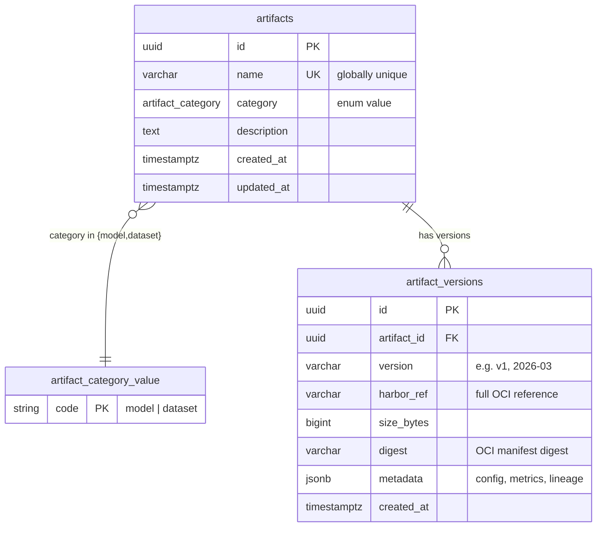
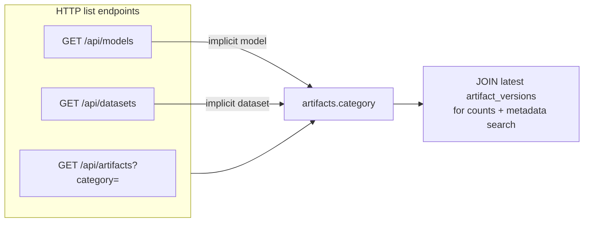

# PostgreSQL Schema — Data Repository Metadata

## Overview

The Data Repository stores blob data (model files, datasets) in Harbor via ORAS. PostgreSQL holds the metadata layer: artifact identity, versioning, category, training configuration, evaluation metrics, and lineage. Consumers never query Harbor for catalog or search — they query this schema.

Artifact names are globally unique and map 1:1 to a Harbor repository under `supernova/`. Each artifact has one or more immutable versions, each pointing to a specific OCI reference in Harbor.

## Entity Relationship

PostgreSQL stores ``category`` as the ``artifact_category`` enum type (not a
separate table). The diagram below shows that **logical** domain as a lookup
entity so the ER view matches how clients filter (``GET /api/artifacts`` and
typed list routes all constrain ``artifacts.category``).



**Logical catalog access (HTTP ↔ discriminator column)**



## DDL

### Types

```sql
CREATE TYPE artifact_category AS ENUM ('model', 'dataset');
```

### Tables

```sql
CREATE TABLE artifacts (
    id          UUID            PRIMARY KEY DEFAULT gen_random_uuid(),
    name        VARCHAR(255)    NOT NULL,
    category    artifact_category NOT NULL,
    description TEXT,
    created_at  TIMESTAMPTZ     NOT NULL DEFAULT now(),
    updated_at  TIMESTAMPTZ     NOT NULL DEFAULT now(),

    CONSTRAINT uq_artifacts_name UNIQUE (name)
);

CREATE TABLE artifact_versions (
    id          UUID            PRIMARY KEY DEFAULT gen_random_uuid(),
    artifact_id UUID            NOT NULL REFERENCES artifacts(id) ON DELETE CASCADE,
    version     VARCHAR(128)    NOT NULL,
    harbor_ref  VARCHAR(512)    NOT NULL,
    size_bytes  BIGINT,
    digest      VARCHAR(128),
    metadata    JSONB           NOT NULL DEFAULT '{}',
    created_at  TIMESTAMPTZ     NOT NULL DEFAULT now(),

    CONSTRAINT uq_artifact_version UNIQUE (artifact_id, version)
);
```

### Indexes

```sql
CREATE INDEX idx_artifacts_category ON artifacts (category);
CREATE INDEX idx_artifacts_created_at ON artifacts (created_at);

CREATE INDEX idx_artifact_versions_artifact_id ON artifact_versions (artifact_id);
CREATE INDEX idx_artifact_versions_created_at ON artifact_versions (created_at);
CREATE INDEX idx_artifact_versions_metadata ON artifact_versions USING GIN (metadata);
```

`pg_trgm` GIN indexes on `artifacts` (migration **0002**) accelerate case-insensitive substring search on `name` and `description` for catalog list queries:

```sql
CREATE EXTENSION IF NOT EXISTS pg_trgm;

CREATE INDEX idx_artifacts_name_trgm ON artifacts USING GIN (name gin_trgm_ops);
CREATE INDEX idx_artifacts_description_trgm ON artifacts USING GIN (description gin_trgm_ops);
```

`artifacts.name` is already indexed via the `UNIQUE` constraint.

## HTTP catalog — list and search

Browsers and services discover artifacts via:

| Method | Path | Role |
|--------|------|------|
| `GET` | `/api/artifacts` | Paginated list; **required** query `category` = `model` or `dataset` (same semantics as the typed routes) |
| `GET` | `/api/models` | Paginated list of **model** artifacts (`category` fixed to `model`) |
| `GET` | `/api/datasets` | Paginated list of **dataset** artifacts (`category` fixed to `dataset`) |

**Query parameters**

| Parameter | Description |
|-----------|-------------|
| `category` | **Required** on `GET /api/artifacts` only: `model` or `dataset`. |
| `search` | Optional. Case-insensitive `ILIKE` on `artifacts.name`, `artifacts.description`, and the **latest** row’s `artifact_versions.metadata` serialized as text. `%` and `_` are SQL wildcards; values are bound as parameters (no SQL injection). If the entire string parses as a JSON **object**, rows also match when latest `metadata` **contains** that object (`@>`). Leading/trailing whitespace is stripped; an empty string is ignored. |
| `limit`, `offset` | Offset pagination (`limit` default 50, max 1000). |
| `page`, `page_size` | Page-based pagination. When `page` is set, `limit` and `offset` are ignored; `page_size` defaults to 50 (max 1000). |

**Response:** `{"total": <int>, "items": [...]}` where each item includes `name`, `category`, `description`, `versions_count`, `latest_version` (from the version with the newest `created_at`), and `created_at` (artifact row).

The repository resolves `total` and the page slice in **one** SQL round-trip (count subquery plus `LEFT JOIN LATERAL` page), so `total` stays correct when `offset` is past the last row.

## Design Decisions

**No separate `artifact_metadata` table.** JSONB on `artifact_versions.metadata` provides the needed flexibility with GIN index support. Avoids unnecessary joins for what are fundamentally version-scoped attributes.

**Lineage in JSONB, not FK columns.** `parent_model`, `source_dataset`, and `source_trainer` live in `metadata.lineage` as string references (artifact name + version). This avoids tight coupling and complex FK graphs while keeping lineage queryable via the GIN index. Can be promoted to first-class FK columns later if referential integrity becomes critical.

**UUID primary keys.** Better for distributed systems and avoids sequential ID leaking.

**Versions are immutable.** No `updated_at` on `artifact_versions` — once pushed, a version is sealed (mirrors OCI semantics). Only the parent `artifacts` row has `updated_at`, bumped when new versions are added or the description changes.

**`digest` instead of `checksum`.** Aligns with OCI terminology. Stores the manifest digest (e.g. `sha256:a3ed95...`) for content-addressable lookups.

**`ON DELETE CASCADE` on versions.** Deleting an artifact removes all its versions. This is intentional — an artifact without versions is meaningless, and Harbor repo deletion is handled separately.

## JSONB Metadata Conventions

The `metadata` column is schema-free, but consumers should follow these conventions. The artifact-level `description` column covers the general purpose of the artifact (e.g. "IRIS ticket classifier for OSL categories"). Version-specific notes go in `metadata.description`.

### Model Versions

Model metadata has five top-level sections: `description`, `training_config`, `model_config`, `eval_metrics`, and `lineage`.

#### Full example (text classification model)

```json
{
  "description": "Fine-tuned on 2026-03 ticket export, improved OSL accuracy by 3%",
  "training_config": {
    "model": "Qwen/Qwen3-1.7B",
    "tokenizer": "Qwen/Qwen3-1.7B",
    "max_seq_length": 512,
    "batch_size": 96,
    "gradient_accumulation_steps": 1,
    "gradient_checkpointing": true,
    "compile_mode": "none",
    "max_steps": 16000,
    "learning_rate": 5e-5,
    "eta_min": 1e-7,
    "warmup_steps": 200,
    "optimizer": "adamw_8bit",
    "scheduler": "cosine_with_min_lr"
  },
  "model_config": {
    "architectures": ["DebertaV2ForSequenceClassification"],
    "model_type": "deberta-v2",
    "hidden_size": 768,
    "num_hidden_layers": 12,
    "num_attention_heads": 12,
    "intermediate_size": 3072,
    "max_position_embeddings": 1024,
    "vocab_size": 32203,
    "torch_dtype": "bfloat16"
  },
  "eval_metrics": {
    "loss": 0.42,
    "accuracy": 0.95
  },
  "lineage": {
    "parent_model": "iris-bert-base:v1",
    "source_dataset": "iris-tickets:2026-03",
    "source_trainer": "supernova-job-12345"
  }
}
```

#### Full example (time-series forecasting model)

```json
{
  "description": "Unified Informer for cross-platform Icinga metric forecasting",
  "training_config": {
    "model": "models/informer-unified-base",
    "batch_size": 16,
    "gradient_accumulation_steps": 1,
    "max_steps": 1500000,
    "learning_rate": 1e-4,
    "warmup_steps": 1000,
    "eta_min": 1e-7,
    "scheduler": "cosine",
    "value_columns": [
      "cpu_load_pct", "memory_pct", "disk_root_pct", "disk_pct",
      "ping_rta_ms", "ping_pl_pct", "swap_free_pct", "process_count",
      "uptime_hours"
    ]
  },
  "model_config": {
    "architectures": ["InformerForPrediction"],
    "model_type": "informer",
    "d_model": 512,
    "encoder_layers": 3,
    "decoder_layers": 2,
    "encoder_attention_heads": 8,
    "decoder_attention_heads": 8,
    "context_length": 576,
    "prediction_length": 12,
    "input_size": 9,
    "feature_size": 101
  },
  "eval_metrics": {
    "mse": 0.0012,
    "mae": 0.021
  },
  "lineage": {
    "parent_model": "informer-unified-base:v1",
    "source_dataset": "icinga-metrics:2026-03",
    "source_trainer": "supernova-job-67890"
  }
}
```

#### Full example (generative LLM, quantized fine-tune)

```json
{
  "description": "Worksheet generation model, fine-tuned from 4-bit Qwen3 MoE",
  "training_config": {
    "model": "woctordho/Qwen3-30B-A3B-fused-bnb-4bit",
    "tokenizer": "woctordho/Qwen3-30B-A3B-fused-bnb-4bit",
    "load_in_4bit": true,
    "max_seq_length": 1024,
    "batch_size": 4,
    "gradient_accumulation_steps": 4,
    "max_steps": 6000,
    "learning_rate": 5e-5,
    "eta_min": 1e-5,
    "warmup_steps": 100,
    "optimizer": "paged_adamw_8bit",
    "scheduler": "cosine_with_min_lr"
  },
  "model_config": {
    "architectures": ["Qwen3MoeForCausalLM"],
    "model_type": "qwen3_moe",
    "hidden_size": 2048,
    "num_hidden_layers": 48,
    "num_attention_heads": 32,
    "max_position_embeddings": 131072,
    "vocab_size": 151936,
    "torch_dtype": "bfloat16"
  },
  "eval_metrics": {
    "loss": 0.38
  },
  "lineage": {
    "source_dataset": "worksheets:2026-03",
    "source_trainer": "supernova-job-11111"
  }
}
```

#### `training_config`

The Etalon training configuration used for this run. Stored as-is from the SuperNova job definition. Key fields present across all training types:

| Field | Type | Description |
|-------|------|-------------|
| `model` | `string` | Base model identifier (HuggingFace hub ID or local path) |
| `tokenizer` | `string` | Tokenizer identifier (usually matches `model`) |
| `batch_size` | `int` | Per-device batch size |
| `gradient_accumulation_steps` | `int` | Gradient accumulation steps |
| `max_steps` | `int` | Maximum training steps |
| `learning_rate` | `float` | Peak learning rate |
| `warmup_steps` | `int` | LR warmup steps |
| `optimizer` | `string` | Optimizer name (`adamw_8bit`, `paged_adamw_8bit`, etc.) |
| `scheduler` | `string` | LR scheduler (`cosine_with_min_lr`, `cosine`, etc.) |

Additional fields vary by task type (e.g. `max_seq_length` for text, `value_columns` for time-series, `load_in_4bit` for quantized training).

#### `model_config`

The HuggingFace `config.json` of the trained model, stored in full or with the most important fields extracted. This contains architecture details that are critical for deployment and compatibility but not typically surfaced by model registries.

| Field | Type | Description |
|-------|------|-------------|
| `architectures` | `string[]` | Model class names (e.g. `["DebertaV2ForSequenceClassification"]`) |
| `model_type` | `string` | HuggingFace model type identifier |
| `hidden_size` | `int` | Hidden dimension size |
| `num_hidden_layers` | `int` | Number of transformer layers |
| `num_attention_heads` | `int` | Number of attention heads |
| `max_position_embeddings` | `int` | Maximum context length the model supports |
| `vocab_size` | `int` | Vocabulary size |
| `torch_dtype` | `string` | Weight precision (`float32`, `bfloat16`, etc.) |

The full `config.json` can be stored verbatim — the GIN index makes all nested fields queryable.

### Dataset Versions

```json
{
  "description": "Exported IRIS tickets for OSL/OSLT classification training",
  "format": "parquet",
  "record_count": 15000,
  "columns": ["input", "osl", "oslt", "type", "priority"],
  "source_system": "iris-tickets",
  "date_range": {
    "from": "2025-01-01",
    "to": "2026-03-01"
  },
  "preprocessing": {
    "deduplication": true,
    "max_length": 4096
  }
}
```

| Field | Type | Description |
|-------|------|-------------|
| `description` | `string` | What the dataset covers and what problem it targets |
| `format` | `string` | Storage format: `parquet`, `hdf5`, `json` |
| `record_count` | `int` | Number of records/rows |
| `columns` | `string[]` | Column names in the dataset |
| `source_system` | `string` | Origin system (e.g. `iris-tickets`, `icinga`) |
| `date_range` | `object` | Time range of the data (`from`, `to` as ISO dates) |
| `preprocessing` | `object` | Any preprocessing applied before storage |

Dataset registration endpoint:

- `POST /api/datasets/{name}/versions`
- Request body mirrors model registration and requires `harbor_ref`
- If `version` is omitted, Data Repository auto-increments to the next `vN`

### Lineage Convention

Lineage references use the format `<artifact-name>:<version>`, matching the Harbor naming convention. This is a soft reference — the referenced artifact must exist but is not enforced by FK constraints.

| Field | Type | Description |
|-------|------|-------------|
| `lineage.parent_model` | `string` | Base model this was fine-tuned from |
| `lineage.source_dataset` | `string` | Dataset used for training |
| `lineage.source_trainer` | `string` | SuperNova job ID that produced this version |

## Example Queries

### List all models

```sql
SELECT a.name, a.description, a.created_at
FROM artifacts a
WHERE a.category = 'model'
ORDER BY a.created_at DESC;
```

### Get all versions of an artifact

```sql
SELECT v.version, v.harbor_ref, v.size_bytes, v.digest, v.created_at
FROM artifact_versions v
JOIN artifacts a ON a.id = v.artifact_id
WHERE a.name = 'iris-osl'
ORDER BY v.created_at DESC;
```

### Resolve a `repo://` URI to a Harbor reference

Used by Solar Control to resolve `repo://iris-osl:v3` to a pullable OCI reference.

```sql
SELECT v.harbor_ref, v.digest, v.size_bytes
FROM artifact_versions v
JOIN artifacts a ON a.id = v.artifact_id
WHERE a.name = 'iris-osl' AND v.version = 'v3';
```

### Search by training config (base model)

```sql
SELECT a.name, v.version, v.metadata->'training_config' AS config
FROM artifact_versions v
JOIN artifacts a ON a.id = v.artifact_id
WHERE v.metadata @> '{"training_config": {"model": "Qwen/Qwen3-1.7B"}}';
```

### Find models by architecture

```sql
SELECT a.name, v.version,
       v.metadata->'model_config'->>'model_type' AS model_type,
       v.metadata->'model_config'->>'hidden_size' AS hidden_size
FROM artifact_versions v
JOIN artifacts a ON a.id = v.artifact_id
WHERE v.metadata @> '{"model_config": {"model_type": "deberta-v2"}}';
```

### Find models that fit a context length requirement

```sql
SELECT a.name, v.version,
       (v.metadata->'model_config'->>'max_position_embeddings')::int AS ctx_len
FROM artifact_versions v
JOIN artifacts a ON a.id = v.artifact_id
WHERE a.category = 'model'
  AND (v.metadata->'model_config'->>'max_position_embeddings')::int >= 1024
ORDER BY ctx_len;
```

### Find models trained on a specific dataset

```sql
SELECT a.name, v.version, v.metadata->'lineage' AS lineage
FROM artifact_versions v
JOIN artifacts a ON a.id = v.artifact_id
WHERE a.category = 'model'
  AND v.metadata @> '{"lineage": {"source_dataset": "iris-tickets:2026-03"}}';
```

### Get latest version of each artifact

```sql
SELECT DISTINCT ON (a.id)
    a.name, a.category, v.version, v.harbor_ref, v.created_at
FROM artifacts a
JOIN artifact_versions v ON v.artifact_id = a.id
ORDER BY a.id, v.created_at DESC;
```

### Filter by eval metrics

```sql
SELECT a.name, v.version,
       (v.metadata->'eval_metrics'->>'accuracy')::float AS accuracy
FROM artifact_versions v
JOIN artifacts a ON a.id = v.artifact_id
WHERE a.category = 'model'
  AND (v.metadata->'eval_metrics'->>'accuracy')::float > 0.9
ORDER BY accuracy DESC;
```

## Migration Strategy

Schema provisioning is handled by **D-005** using Alembic, following the same pattern established in the orchestrator project.

### Project Structure (target)

```
data-repository/
├── alembic.ini
├── database/
│   └── migrations/
│       ├── env.py
│       ├── script.py.mako
│       └── versions/
│           └── 0001_initial_schema.py
├── modules/
│   └── database/
│       ├── models.py          # SQLAlchemy ORM (Base, Artifact, ArtifactVersion)
│       └── database_config.py # connection URL from env vars
└── .env                       # POSTGRES_HOST, POSTGRES_PORT, etc. (gitignored)
```

### Connection Configuration

Alembic `env.py` will read connection parameters from environment variables, consistent with the `.env` approach for local development and K8s secrets for production:

- `POSTGRES_HOST`
- `POSTGRES_PORT`
- `POSTGRES_DB`
- `POSTGRES_USER`
- `POSTGRES_PASSWORD`

### Local Development

A `docker-compose.yaml` will provide a local PostgreSQL instance. Configuration flows through `.env` (gitignored).

## Consumers

| Consumer | Usage | Relevant Queries |
|----------|-------|------------------|
| Solar Control | `repo://` URI resolution, model distribution | Resolve artifact + version to `harbor_ref` |
| SuperNova Control | Job orchestration, lineage tracking | Search by metadata, create versions after training |
| SuperNova WebUI | Catalog browsing, version history, metrics display | List artifacts, filter by category, search metadata |

## Related Issues

- **D-005** — Provision this schema (Alembic initial migration)
- **D-006** — Harbor API integration (syncs Harbor state with this metadata)
- **D-007, D-009, D-011** — API endpoints that read/write this schema
