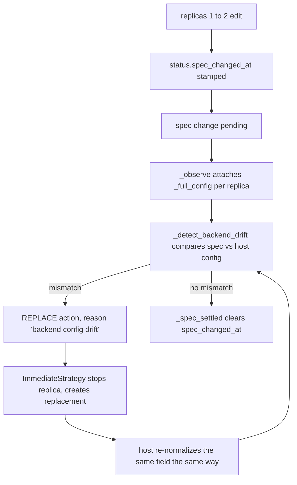
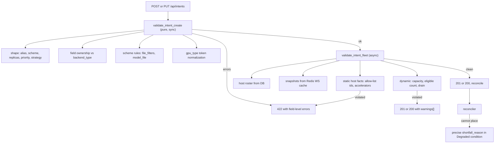

# Unified implementation plan — five reported problems

Single PR across `solar-control`, `solar-host`, `solar-webui`.

This document is self-contained: every problem statement, root cause and fix is
restated here with file/line evidence, so no external report is needed.

---

## 0. Scope and sequencing

Five independent problems, one PR, ordered commits. The order matters because
later cases build on earlier infrastructure:

1. **C1 — drift churn.** Intent edits with `replicas > 1` loop forever:
  stop/recreate on every tick, never converge.
2. **C2 — invisible start failures.** A `502 ... Process exited unexpectedly
  (exit code: 1)` reaches the webui with no way to read the process log.
3. **C5 — WS-first host telemetry.** Host resource snapshots move from
  per-tick HTTP proxying to the existing WebSocket push + Redis read model.
   *Done before C3 because C3's capacity validation needs cheap snapshots.*
4. **C4 — cold-start timeout and pull progress.** One-line timeout bug plus
  download progress telemetry host to control to webui.
5. **C3 — intent validation.** Impossible configurations get rejected at the
  API with field-level errors instead of degrading silently.


### Decisions taken up front

- `device` stays a **HuggingFace-only field**. It is already only rendered for
HF backends in the webui; the API will now reject it for `llamacpp` instead
of silently dropping it, and validate it against host hardware class for HF
backends. (See §3 for the full reasoning.)
- Dynamic fleet state (host offline, draining, transient capacity) produces
**advisory warnings**, never a hard 422 — a temporarily offline host must not
block an edit. Static, durable facts produce hard 422s.
- `huggingface_vision` is a valid `backend_type` in the API and in
`apps/solar-webui/src/api/types.ts`, but has no card in the webui mode
picker. **Explicit non-goal** for this PR; noted as a follow-up issue.

---


## 1. C1 — solver-v4 replica 1 to 2: infinite stop/recreate loop


### Symptom

Raising an intent's replica count from 1 to 2 scales onto both Mac Studio
hosts, then stops and recreates the replicas on both hosts forever. The intent
never converges. Observable as repeated pairs in the control log:
`Creating instance ...` followed by
`Stopping instance <fresh-id> (reason: Immediate: stopping old replica)`.

### Root cause

The loop is the pending-spec deep-compare path combined with a comparison that
is not normalization-aware.




Step by step, with evidence:

1. A spec edit stamps `status["spec_changed_at"]` in
  [apps/solar-control/app/database/intents.py](apps/solar-control/app/database/intents.py)
   lines 176-183. `_spec_version(intent)` reads it back
   ([reconciliation.py:2224-2231](apps/solar-control/app/services/reconciliation.py)).
2. While it is set, `_observe` loads each managed replica's **full** config
  from the host (one HTTP round trip per replica per tick) via
   `capture_instance_config`
   ([reconciliation.py:757-791](apps/solar-control/app/services/reconciliation.py)).
   In steady state this window is closed; a pending edit opens it.
3. `_detect_backend_drift`
  ([reconciliation.py:2250-2285](apps/solar-control/app/services/reconciliation.py))
   compares every intent backend key not in `_skip_keys` against the stored
   config, using `_backend_value_matches`
   ([reconciliation.py:2288-2304](apps/solar-control/app/services/reconciliation.py)).
   That matcher only handles one case: a bare filename in the spec that is the
   tail of an absolute path in the instance config.
4. Any mismatch yields a `REPLACE` action
  ([reconciliation.py:976-1008](apps/solar-control/app/services/reconciliation.py)),
   and `ImmediateStrategy` stops the replica and creates a replacement
   ([strategies.py:660-738](apps/solar-control/app/services/strategies.py),
   message `Immediate: stopping old replica`).
5. The replacement goes through the host, which applies the **same**
  normalization, reproducing the same difference. `_spec_settled` never
   returns true ([reconciliation.py:2234-2247](apps/solar-control/app/services/reconciliation.py)),
   so `spec_changed_at` is never cleared and the loop is closed.


### The two residual drift vectors

**A.** `chat_template_kwargs` **— normalization mismatch (prime suspect).**

The webui stores it as free text
([BackendConfigFields.tsx:346-362](apps/solar-webui/src/components/BackendConfigFields.tsx))
and the intent backend carries it verbatim. The host **always** rewrites it at
the config boundary: `LlamaCppConfig.normalize_chat_template_kwargs`
([apps/solar-host/solar_host/models/llamacpp.py:107-129](apps/solar-host/solar_host/models/llamacpp.py))
parses the JSON, recursively coerces `"true"`/`"false"` strings to real
booleans (`_coerce_template_kwargs`, lines 9-25), and re-serializes as compact
canonical JSON (`_serialize_template_kwargs`, lines 28-30, using
`separators=(",", ":")`).

So all three of these read as drift today:

- spec `{"enable_thinking": true}` (a dict) vs stored `'{"enable_thinking":true}'` (a string)
- spec `'{"enable_thinking": true}'` (with a space) vs stored `'{"enable_thinking":true}'`
- spec `'{"enable_thinking": "true"}'` vs stored `'{"enable_thinking":true}'`

**B.** `mmproj` **as a glob or relative path — resolver mismatch.**

The host resolves `model_file` **and** any non-absolute `mmproj` to absolute
paths at create time
([apps/solar-host/solar_host/config.py:196-236](apps/solar-host/solar_host/config.py),
`_resolve_llamacpp_file_patterns`). `model` is in `_skip_keys` so the resolved
model path is exempt, but `mmproj` **is not**, and the existing tail matcher
only accepts a bare filename with no `/`. A spec glob such as
`mmproj: "*mmproj-BF16*.gguf"` or a relative path like `sub/mmproj.gguf` still
mismatches the resolved absolute path. The webui lets the user type a glob.

### Fix

**1.1 — Canonicalizing comparison.** Rewrite `_backend_value_matches` in
[apps/solar-control/app/services/reconciliation.py](apps/solar-control/app/services/reconciliation.py)
to try, in order:

- exact equality (unchanged fast path),
- **JSON-structural equality**: if either side is a `str` that parses as JSON,
or the spec side is a `dict`/`list`, parse both and compare after applying
the same recursive boolean coercion the host applies. Implement a small
private `_coerce_jsonish` mirroring
`solar_host.models.llamacpp._coerce_template_kwargs` (control cannot import
`solar_host`; the duplication is intentional and gets a test that pins the
two behaviours together),
- **path/glob equality**: if the instance value is an absolute path and the
spec value is either a glob (contains any of `*?[`) or a relative path,
match with `fnmatch(os.path.basename(inst), spec)` for globs and
`inst.endswith("/" + spec.lstrip("./"))` for relative paths. Keep the
existing bare-filename tail behaviour as a subcase.

**1.2 — Canonicalize at the API boundary.** So new intents never store a
non-canonical form in the first place, normalize `backend.chat_template_kwargs`
during intent validation: parse, coerce booleans, re-serialize compact. Add
this as `canonicalize_intent_backend(backend)` in
[apps/solar-control/app/validation.py](apps/solar-control/app/validation.py),
called from the create and update routes in
[apps/solar-control/app/routes/management/intents.py](apps/solar-control/app/routes/management/intents.py)
before persisting. Invalid JSON becomes a 422 on
`backend.chat_template_kwargs` instead of a runtime host error. 1.1 remains
required for already-stored intents.

**1.3 — Churn circuit breaker.** Any future drift vector should degrade, not
loop forever. Track consecutive drift-driven REPLACE rounds for an intent in
`status_json`:

- add `drift_replace_attempts: int` to `IntentStatus`
([apps/solar-control/app/models/intent.py](apps/solar-control/app/models/intent.py)),
- increment it in `_update_status` when the planned actions contain a REPLACE
whose reason is `backend config drift`; reset to 0 when `spec_settled` is
true or `spec_changed_at` changes,
- when it exceeds `settings.max_drift_replace_attempts` (new setting, default
`3`), stop planning REPLACE for that intent, and instead record a
`last_error` with code `BackendDriftUnsettled` naming the specific
mismatching keys, plus a `Degraded` condition with reason
`DriftUnsettled`. This converts an infinite loop into one clear,
actionable error.

To name the mismatching keys, change `_detect_backend_drift` to return the
list of drifted keys (`list[str]`) rather than `bool`; the single call site at
[reconciliation.py:976-980](apps/solar-control/app/services/reconciliation.py)
becomes a truthiness check on the list.

### Operational stopgap (for the live incident, no code)

Scale the intent to 0 and back to 1 — that clears the stuck
`strategy_progress` and the scale-up then goes through the normal shortfall
path — or delete and recreate the intent.

---


## 2. C2 — surface instance process logs in the webui on start failures


### Symptom

The webui shows, as plain text with no affordance:

> 502: Host 'damcpmacstudio01' failed to start instance
> f72e73af-d67c-4d1f-acc0-d6e67a83f488: HTTP 500 —
> {"detail":"Failed to start instance: Process exited unexpectedly (exit code: 1)"}

The user cannot see why the process exited, for either llama.cpp or
HuggingFace backends.

### Where the error comes from

1. **Host.** The start call parks on an `asyncio.Event` until the backend logs
  its ready line or the process dies
   ([process_manager.py:551-637](apps/solar-host/solar_host/process_manager.py)).
   On unexpected exit, `_handle_child_exit` sets status `FAILED` and
   `error_message = "Process exited unexpectedly (exit code: N)"`
   ([process_manager.py:160-208](apps/solar-host/solar_host/process_manager.py)).
   The start route answers HTTP 500 with that detail. Process supervision is
   backend-agnostic, so llama.cpp and HuggingFace behave identically.
2. **Control.** `Reconciler._start_instance` turns any non-200 host response
  into a 502 whose detail is a free-text string
   ([reconciliation.py:1876-1910](apps/solar-control/app/services/reconciliation.py)).
   The instance id exists only inside that string.


### What already works

The log pipeline is built end to end and is not the problem:

- Host writes every stdout line to `{alias}_{timestamp}.log`
([process_manager.py:564-565](apps/solar-host/solar_host/process_manager.py)),
buffers it in `log_buffers` (a `deque(maxlen=settings.log_buffer_size)`, 1000
by default — [process_manager.py:283-299](apps/solar-host/solar_host/process_manager.py)),
queues it thread-safely in `_push_log_event`
([process_manager.py:392-407](apps/solar-host/solar_host/process_manager.py)),
and flushes batches as `log_batch` over the WebSocket
([ws_client.py:335-337](apps/solar-host/solar_host/ws_client.py)).
- Control fans `log_batch` out as per-line `log` events on `/webui`
([host_handlers.py:354-385](apps/solar-control/app/socketio_app/host_handlers.py))
and proxies the history endpoint at
`GET /api/hosts/{host_id}/instances/{instance_id}/logs`
([hosts.py:409-412](apps/solar-control/app/routes/management/hosts.py)).
- Webui `LogViewer` merges the historical fetch with the live stream, dedup by
`seq:timestamp` ([LogViewer.tsx:21-86](apps/solar-webui/src/components/LogViewer.tsx)),
fed by `useEventStream`'s `logs` map, capped at 1000 lines per instance
([useEventStream.ts:318-336](apps/solar-webui/src/hooks/useEventStream.ts)).


### The three gaps

**Gap 1 — the buffer is destroyed at the moment of failure.**
`_handle_child_exit` calls `_purge_instance_resources`, which pops
`log_buffers[instance_id]` and `log_sequences[instance_id]`
([process_manager.py:143-158](apps/solar-host/solar_host/process_manager.py),
called at line 203). The exact logs the user needs vanish the instant the
process dies. The on-disk file survives but only briefly: `_cleanup_old_logs`
unlinks every matching file with an mtime older than 300 seconds
([process_manager.py:713-721](apps/solar-host/solar_host/process_manager.py)).
The reconciler then often RECREATEs, deleting the instance record entirely.

**Gap 2 — the error is not linked to anything.** `LastError` is
`{code, message, host_id, source_uri, at}` with **no** `instance_id`
([apps/solar-control/app/models/intent.py:163-171](apps/solar-control/app/models/intent.py)),
and `IntentDetail` renders it as plain text
([IntentDetail.tsx:355-373](apps/solar-webui/src/components/IntentDetail.tsx)).

**Gap 3 — no log tail in the error payload**, so even when logs do exist the
user has to go hunting.

### Fix

**2.1 — Keep logs across failure and stop (host).** In
[apps/solar-host/solar_host/process_manager.py](apps/solar-host/solar_host/process_manager.py):

- Give `_purge_instance_resources` a `keep_logs: bool = False` parameter. Pass
`keep_logs=True` from `_handle_child_exit` (line 203) and from
`stop_instance` (line 694); keep the current purging behaviour for
`delete_instance` (line 850) and the stale-start reset (line 520).
- Retained buffers must not leak on a churning host. Add an ordered registry of
retained dead-instance ids and evict the oldest beyond
`settings.retained_log_buffers` (new setting, default `20`). Each buffer is
already `maxlen`-bounded, so the worst case is bounded at
`retained_log_buffers * log_buffer_size` lines.

**2.2 — Longer on-disk retention plus instance-addressable files (host).**

- Include the instance id in the log filename:
`{alias_safe}_{instance_id}_{timestamp}.log` (line 564-565). This makes the
file findable by instance id after the instance record is gone.
- Replace the 300-second unlink in `_cleanup_old_logs` with
`settings.log_file_retention_s` (new setting, default `86400`), and always
keep the most recent file per alias regardless of age so the last boot is
never lost. Fix the existing comment, which claims "keep only the most
recent" while the code deletes everything older than 300 s.

**2.3 — File fallback on the logs endpoint (host).** In
[apps/solar-host/solar_host/routes/instances.py:220-231](apps/solar-host/solar_host/routes/instances.py):

- When the in-memory buffer is empty, read the newest log file matching
`*_{instance_id}_*.log` from `log_dir` and return it as `LogMessage` rows
(synthesizing `seq` from the line index, and using the file mtime for
`timestamp` since per-line timestamps are not in the file).
- Drop the hard 404 when the instance record is gone but a log file exists, so
post-mortem reads still work. Keep the 404 when neither exists.
- Bound the file read to the last `settings.log_buffer_size` lines.

**2.4 — Structured start-failure response (host).** The start route currently
returns a plain string detail. Extend it to a JSON body:
`{"detail": "...", "instance_id": "...", "exit_code": N, "log_tail": [...]}`
where `log_tail` is the last `settings.start_failure_log_tail_lines` lines
(new setting, default `20`) read from the retained buffer.

**2.5 — Structured error plumbing (control).** In
[apps/solar-control/app/services/reconciliation.py](apps/solar-control/app/services/reconciliation.py):

- Add `instance_id: str | None`, `log_tail: list[str] | None` and
`recoverable: bool = False` to `LastError`
([apps/solar-control/app/models/intent.py:163-171](apps/solar-control/app/models/intent.py)).
`recoverable` is used by C4; introduced here so the schema changes once.
- In `_start_instance`, parse the host body as JSON when possible and raise an
`InstanceStartFailed(HTTPException)` carrying `.instance_id`, `.log_tail` and
`.exit_code`. Keep the human-readable 502 detail for backwards
compatibility, and keep the existing `StartOutcomeUnknown` path for
network-level failures.
- At all three `last_error` construction sites — the delete/scale-to-zero path
(lines 393-399), the normal reconcile path (lines 473-479) and
`_continue_strategy` (lines 640-646) — populate
`instance_id` from `getattr(e, "instance_id", None) or action.instance_id`
and `log_tail` from `getattr(e, "log_tail", None)`. Map them through in
`_update_status` where `LastError` is built (lines 2123-2132).

**2.6 — Webui: clickable logs on the error (webui).**

- Add `instance_id`, `log_tail`, `recoverable` to `IntentLastError` in
[apps/solar-webui/src/api/types.ts](apps/solar-webui/src/api/types.ts).
- In [IntentDetail.tsx](apps/solar-webui/src/components/IntentDetail.tsx),
inside the existing `last_error` block (lines 355-373): render the `log_tail`
as a monospace `<pre>` when present, and add a "View process logs" button
when both `host_id` and `instance_id` are set, opening the existing
`LogViewer` with those ids and the intent alias.
- `LogViewer` already tolerates an empty history; with 2.3 in place it will
receive the file contents for deleted instances. Add a clear empty state
("No logs retained for this instance") instead of a bare empty box.

---


## 3. C5 — polling should be a fallback, not the primary channel

Done before C3 because C3's fleet-capacity validation needs cheap snapshots.

### Current state

The Socket.IO pipeline is already complete and the webui is already
socket-first. Events flowing host to control to `/webui`:
`host_status`, `host_pending`, `host_pending_removed`, `instances_update`,
`instance_state`, `log`, `host_health`, `step_log`, job lifecycle,
`intent_update`, `intent_removed`, `gateway_request` — all bound in one place
at [useEventStream.ts:554-606](apps/solar-webui/src/hooks/useEventStream.ts).

Webui polling is mostly a correct fallback already:

- `IntentsPage` 10 s, event map is primary
([IntentsPage.tsx:23, 69-76](apps/solar-webui/src/components/IntentsPage.tsx)) — correct shape.
- `IntentDetail` 5 s
([IntentDetail.tsx:18, 88-95](apps/solar-webui/src/components/IntentDetail.tsx)) — correct shape.
- `ResourcesPage` event-driven with a debounced refetch on a stream signature
plus a connection-gated 20/60 s fallback
([ResourcesPage.tsx:92-120](apps/solar-webui/src/components/ResourcesPage.tsx)) — the reference pattern.
- `GatewayDashboard` `isConnected`-gated 30/120 s
([GatewayDashboard.tsx:226-238](apps/solar-webui/src/components/GatewayDashboard.tsx)) — fine.
- `RoutingGraph` **10 s unconditional poll** of `GET /endpoints`, no event
drives it and no connection gating
([RoutingGraph.tsx:98-111](apps/solar-webui/src/components/RoutingGraph.tsx)) — the one webui offender.


### The real residue is in solar-control

**Residue 1 — a resource HTTP call per host per tick.**
`_fetch_host_resource_snapshot`
([resources.py:31-185](apps/solar-control/app/routes/management/resources.py))
does `GET {host.url}/resources` with a 5 s timeout. It is called from five
places: `GET /api/resources` (line 236), the reconciler's `_observe`
(reconciliation.py:704), the MIGRATE action (reconciliation.py:1575), and the
reservation coordinator (reservation.py:209 and :297). With a 10 s reconcile
interval that is N HTTP calls every 10 seconds plus one per webui page load.

The host already pushes `host_health` every 10 seconds
([main.py:143](apps/solar-host/solar_host/main.py) health loop,
[ws_client.py:380-424](apps/solar-host/solar_host/ws_client.py)) and control
already consumes it, updating the host DB row and waking the reconciler
([host_handlers.py:418-466](apps/solar-control/app/socketio_app/host_handlers.py)).
The pushed payload is close but incomplete: it carries memory, gpu_type, roles,
instance counts, disk totals, and a `reservations` block with per-dimension
totals and an `active_count` — but **not** the per-reservation list
(`id`, `job_id`, `workload_type`, `status`, `vram_gb`, `ram_gb`, `disk_gb`,
`actual_*`, `expires_at`) or `memory_type`. Those are exactly what
`_fetch_host_resource_snapshot` needs, so today the HTTP call cannot be
avoided. This is the same gap the instances cache already closed with
`host_store.set_host_instances` plus a WS push.

**Residue 2 — gateway HTTP fallback.** `gateway.py` polls a connected host over
HTTP when its Redis instance cache is empty
([gateway.py:134-143](apps/solar-control/app/gateway.py), logging
"Host %s is connected but has no cached instances; polling HTTP"). This is
already the intended degraded path; leave it, it is rare by design.

**Residue 3 —** `capture_instance_config` **bursts.** N synchronous host calls per
tick while a spec edit is pending
([reconciliation.py:757-791](apps/solar-control/app/services/reconciliation.py)).

### Fix

**5.1 — Full resource snapshot in the health push (host).** In
`SolarHostWSClient.send_health`
([ws_client.py:380-424](apps/solar-host/solar_host/ws_client.py)), replace the
hand-assembled `reservations` block with the whole snapshot:
`health_data["resources"] = snap.model_dump(mode="json")` where `snap` is
`resource_manager.snapshot()` — byte-identical to what `GET /resources`
returns ([routes/resources.py:106-113](apps/solar-host/solar_host/routes/resources.py)).
Keep the existing summary keys so older control versions keep working.

**5.2 — Redis read model (control).** In
[apps/solar-control/app/redis_state/hosts.py](apps/solar-control/app/redis_state/hosts.py),
following the exact shape of `set_host_instances`/`get_host_instances`
(lines 76-87), add a new key `SNAPSHOTS_MAP = "solar:hosts:snapshots"` and:

- `set_host_resource_snapshot(host_id, snapshot: dict, *, at: str)`
- `get_host_resource_snapshot(host_id) -> dict | None`

The stored value is `{"at": <iso8601>, "resources": {...}}`. The `at` field is
what makes freshness gating possible. No TTL, matching the instances map;
staleness is decided on read.

**5.3 — Persist on health (control).** In the `host_health` handler
([host_handlers.py:418-466](apps/solar-control/app/socketio_app/host_handlers.py)),
when `health_data` contains `resources`, write it via
`host_store.set_host_resource_snapshot`. Everything else in the handler stays
as is.

**5.4 — Cache-first snapshot read (control).** Restructure
`_fetch_host_resource_snapshot`
([resources.py:31-185](apps/solar-control/app/routes/management/resources.py))
so the merge logic is shared and the source is selectable:

- Extract the dimension/reservation merge into
`_merge_resource_payload(base, data)` — pure, unit-testable.
- Use the Redis snapshot when the host is currently connected **and** the entry
is younger than `settings.host_snapshot_max_age_s` (new setting, default
`30.0`, i.e. three health ticks). Otherwise fall back to the existing HTTP
path. Both go through `_merge_resource_payload`.
- Add `snapshot_source: Literal["ws", "http", "none"]` to
`HostResourceSnapshot` so the read model is observable in the API and
assertable in tests.

The result: the steady-state reconcile tick makes zero resource HTTP calls, and
the webui Resources page becomes near-instant, while an unconnected or stale
host still degrades to HTTP exactly as today.

**5.5 — Event-driven endpoints for RoutingGraph.** `GET /endpoints` returns the
multi-tenant API endpoint records, which change only when a user edits them —
so a 10 s unconditional poll is pure waste. Emit
`endpoints_update` on `/webui` from the endpoint create/update/delete routes in
`apps/solar-control/app/routes/management/`, bind it in
[useEventStream.ts:554-606](apps/solar-webui/src/hooks/useEventStream.ts) with
an `endpoints` state array, and have
[RoutingGraph.tsx](apps/solar-webui/src/components/RoutingGraph.tsx) consume
that, keeping the poll only as a disconnected fallback.

**5.6 — Shared fallback-polling hook.** Add
`apps/solar-webui/src/hooks/useFallbackPolling.ts`:

```ts
useFallbackPolling(callback: () => void, { enabled, intervalMs })
```

It skips ticks when `document.hidden` (matching the existing inline guards) and
does nothing when `enabled` is false. Migrate `IntentsPage`, `IntentDetail`,
`RoutingGraph` and `GatewayDashboard` onto it, gating on `!isConnected` from
`useEventStreamContext`, with `ResourcesPage` keeping its wider
signature-driven refresh.

**5.7 — Memoize** `capture_instance_config` **per pending window.** Cache captured
configs in the reconciler keyed by `(instance_id, spec_version)` so repeated
ticks inside the same pending-edit window do not re-fetch. Bounded, cleared
when `spec_changed_at` changes.

**Explicit non-goal:** putting the full instance config into the
`instances_update` WS payload. The flat cache is deliberate — the docstring on
`_detect_backend_drift`
([reconciliation.py:2250-2265](apps/solar-control/app/services/reconciliation.py))
records that comparing absent fields as `None` is what produced the original
REPLACE-stop loop. Widening that payload would make drift detection see every
field on every tick, which is precisely the failure mode C1 is fixing. It needs
its own design pass.

**5.8 — Codify the rule.** New host-facing data must arrive by WS push (host to
control to webui) with Redis as the control-side read model; HTTP proxying stays
only as a degraded fallback for unreachable or unconnected hosts. Documented in
§10.

---


## 4. C4 — replica-change feedback lag and cold-start timeout


### Symptoms

1. Changing the replica count takes a long time before any feedback appears.
2. A `TimeoutError` shows up when the model was not already downloaded on the
  host, while the host machine visibly still has network traffic.
3. General ask: better communication between solar-host and solar-control.


### Root cause A — confirmed one-line bug

The per-action timeout helper `_action_timeout_s`
([reconciliation.py:105-113](apps/solar-control/app/services/reconciliation.py))
gives cold-start-capable actions (`CREATE`, `EVACUATE`, `MIGRATE`) a bound of
`model_pull_timeout_s + host_start_timeout_s + 60` (1800 + 900 + 60, about
46 minutes) and everything else the raw `_ACTION_TIMEOUT_S = 60`. It was applied
to two of the three action-execution sites but not the main one:

- delete / scale-to-zero priority path — `_action_timeout_s(action)`, correct
([reconciliation.py:372-374](apps/solar-control/app/services/reconciliation.py));
- `_continue_strategy` — no `wait_for` at all, so unbounded, correct for cold
starts ([reconciliation.py:603-677](apps/solar-control/app/services/reconciliation.py));
- **normal reconcile flow**, which is where a shortfall CREATE from a replica
1 to 2 edit lands — hardcoded `_ACTION_TIMEOUT_S`
([reconciliation.py:439-456](apps/solar-control/app/services/reconciliation.py)).

A cold-start CREATE is a multi-GB host model pull plus create plus a blocking
start that waits for backend readiness. The 60 s bound fires first, the
`asyncio.TimeoutError` lands in `last_error`, and the webui renders
`TimeoutError · host ... · huggingface://...` while the host keeps downloading.
The per-URI pull lock
([models_manager.py:342-354, 645-646](apps/solar-host/solar_host/models_manager.py))
makes retries converge eventually, so the deployment does recover — but the
user is left with a dead-end error contradicting what the host is doing.

**Fix 4.1:** use `timeout=_action_timeout_s(action)` at
[reconciliation.py:455](apps/solar-control/app/services/reconciliation.py),
plus a regression test asserting a CREATE through the normal diff path is not
bounded at 60 s.

### Root cause B — the bound can still fire mid-download

Even after 4.1, `model_pull_timeout_s = 1800`
([config.py:89](apps/solar-control/app/config.py)) aborts the control-to-host
pull request at 30 minutes, and the per-action bound is about 46 minutes. On a
slow or wedged link a multi-GB pull can exceed that while still progressing.
The host side is not cancelled by the client abort — `pull_model` runs via
`asyncio.to_thread` ([routes/models.py:224-240](apps/solar-host/solar_host/routes/models.py))
— but control records a timeout anyway.

**Fix 4.2:** make the bound progress-aware rather than merely larger. Replace
the single `asyncio.wait_for` for cold-start actions with a helper
`_await_action_with_progress(coro, action, intent)` that waits in slices of
`settings.action_progress_slice_s` (new setting, default `120.0`); at each
slice boundary it checks Redis for pull progress for
`(action.host_id, intent.model_source)` and keeps waiting while that entry is
newer than `settings.pull_progress_stale_after_s` (new setting, default
`180.0`), up to a hard ceiling of `_action_timeout_s(action)`. When it does
give up while progress was recent, the recorded `last_error` gets
`recoverable = True` (the field added in 2.5) so the webui can present it as
"still downloading" rather than a hard failure.

### Root cause C — no pull progress telemetry exists

`POST /models/pull` is a blocking request
([routes/models.py:199-252](apps/solar-host/solar_host/routes/models.py)) and
`models_manager.pull_model` has no progress hooks, no WS events and nothing
pollable. During a cold start there is no instance yet, so the webui has
nothing at all to show.

Note on the perceived lag: the phase chip itself is prompt. The reconciler
recomputes phase every 10 s tick
([config.py:72](apps/solar-control/app/config.py)) and emits `intent_update`
after every status persist
([reconciliation.py:2171-2202](apps/solar-control/app/services/reconciliation.py)),
which the webui consumes. What is missing is content: minutes of
"reconciling/degraded" with zero detail, then a Timeout. Two things close it —
progress telemetry, and surfacing the already-persisted
`strategy_progress.message` in the list view.

**Fix 4.3 — host emits progress.** The key constraint: by default pulls run in
a `pebble.ProcessPool` subprocess (`settings.pull_use_subprocess = True`), so
progress must cross a process boundary. Neither `huggingface_hub.snapshot_download`
nor `OrasHelper.pull` exposes byte callbacks here. But the parent already runs
a poll loop every `pull_disk_poll_interval_s` (0.5 s) while the future is
pending, purely to check free disk
([models_manager.py:788-803](apps/solar-host/solar_host/models_manager.py)).

Measure progress there instead of instrumenting either downloader:

- Add an optional `progress_cb: Callable[[dict], None] | None = None` parameter
to `pull_model`.
- In the existing parent poll loop, throttled to
`settings.pull_progress_interval_s` (new setting, default `5.0`), call
`progress_cb` with `{source_uri, phase, bytes_done, bytes_total, speed_bps}`
where `bytes_done = _compute_dir_size(target_dir)` (the helper already exists
and is used at line 837), `bytes_total = size_bytes` when the caller supplied
it, and `speed_bps` from the delta since the previous sample.
- Phases: `resolving`, `downloading`, `verifying`, `finalizing`, `completed`,
`failed`. Emit terminal events from the existing success and error paths.
- `bytes_total` is known for `repo://` pulls, since the Data Repository sends
`size_bytes` in the Harbor pull payload
([app/model_resolvers/repo.py](apps/solar-control/app/model_resolvers/repo.py))
and it is already used for the proactive disk check
([models_manager.py:727-741](apps/solar-host/solar_host/models_manager.py)).
For `huggingface://` it is unknown, so report `bytes_total: null` and let the
UI show an indeterminate bar with a byte counter. Deriving an HF total via
`HfApi().model_info(..., files_metadata=True)` is a deliberate follow-up, not
part of this PR.
- In-process mode (used by tests) has no poll loop, so it emits start and
terminal events only.
- Keep `models_manager` free of asyncio and WS coupling: it only calls a plain
callback, which makes it trivially unit-testable.

**Fix 4.4 — bridge the callback to the WebSocket (host).** In
[routes/models.py](apps/solar-host/solar_host/routes/models.py), capture the
running loop before `asyncio.to_thread` and build a callback that uses
`asyncio.run_coroutine_threadsafe(ws_client.broadcast_pull_progress(payload), loop)`
— the same thread-to-loop bridging pattern already used for log events. Add
`broadcast_pull_progress` and `send_pull_progress` to
[ws_client.py](apps/solar-host/solar_host/ws_client.py), emitting a
`pull_progress` event on `/hosts` with the standard `{timestamp, data}`
envelope.

**Fix 4.5 — control rebroadcasts and caches.** In
[host_handlers.py](apps/solar-control/app/socketio_app/host_handlers.py), add a
`pull_progress` handler that resolves `host_id` from the sid, writes the latest
payload into a new Redis hash `solar:hosts:pulls` under field
`{host_id}|{source_uri}` with an `at` timestamp, and re-emits `pull_progress`
on `/webui` with `{host_id, host_name, timestamp, data}` — the same shape as
the neighbouring handlers. Add a `GET /api/pulls` management route returning
the hash so a late-joining webui client can render current state without
waiting for the next event.

**Fix 4.6 — webui renders progress.** Bind `pull_progress` in
[useEventStream.ts](apps/solar-webui/src/hooks/useEventStream.ts) into a
`pullProgress` map keyed `{host_id}|{source_uri}`, exposed via a
`getPullProgress(hostId, sourceUri)` helper alongside the existing
`getInstanceLogs`/`getInstanceState` accessors. Then:

- [IntentDetail.tsx](apps/solar-webui/src/components/IntentDetail.tsx): while
the phase is `reconciling` or `degraded` and progress exists for the intent's
`model_source`, render a progress row above the replicas table — percentage
and bar when `bytes_total` is known, byte counter and speed otherwise. Reuse
the existing bar markup from
[upload/ProgressStep.tsx:196-203](apps/solar-webui/src/components/upload/ProgressStep.tsx)
(`h-2 rounded-full bg-nord-3` track, `bg-nord-10` fill) — there is no shared
progress component and inline bars are the established pattern.
- [IntentsPage.tsx](apps/solar-webui/src/components/IntentsPage.tsx): show
`status.strategy_progress.message` (already persisted, already delivered by
`intent_update`, currently only rendered in the detail view at
[IntentDetail.tsx:324-353](apps/solar-webui/src/components/IntentDetail.tsx))
as a secondary line under the phase badge, falling back to a compact
"downloading X of Y" when pull progress is active. This alone closes most of
the perceived feedback lag.
- Render `last_error.recoverable` as an amber "still working" notice rather
than the red error block.

**Fix 4.7 — fetch initial state.** Add `getPulls()` to
[client.ts](apps/solar-webui/src/api/client.ts) and call it once on mount in
`IntentDetail`, so a page load during a cold start shows progress immediately.

---


## 5. C3 — invalid configuration combinations accepted silently


### Symptom

Reconciliation accepts combinations that cannot work — the reported example is
selecting `mps` as the device and then an NVIDIA-type host in the allowed hosts
list. The intent then sits in a degraded/shortfall state with a generic
message instead of failing fast with a clear reason. Errors should surface
before instance creation, in an understandable form.

### Design pass — findings

This case was originally raised with five open questions. Reading the code
resolves all five, and shrinks the problem considerably.

**Finding 1 —** `gpu_type` **is already a closed vocabulary, just not enforced.**
`detect_gpu_type()`
([apps/solar-host/solar_host/memory_monitor.py:59-86](apps/solar-host/solar_host/memory_monitor.py))
returns exactly three values: `nvidia_cuda`, `apple_mps`, `cpu`. Hosts report it
at registration and on every health push
([ws_client.py:303-310, 373-382](apps/solar-host/solar_host/ws_client.py)), and
control stores it on the host row. The webui already builds its GPU-type
dropdown from distinct live host values
([IntentFormModal.tsx:510-519](apps/solar-webui/src/components/IntentFormModal.tsx)),
and `utils.ts` already has display labels for those three tokens. But
`PlacementConstraints.gpu_type` is a bare `str | None`
([apps/solar-control/app/models/intent.py:58](apps/solar-control/app/models/intent.py))
and placement filters on exact string equality
([placement.py:110](apps/solar-control/app/services/placement.py)), so any typo
or casing variant silently matches nothing.

*Answer to "enum or hardware class?": both, for different jobs.* `gpu_type`
becomes a validated, normalized token (an accelerator vocabulary), and
**hardware class** — discrete VRAM versus unified memory, derivable from the
host snapshot where `snap.vram is None` means unified memory
([resources/manager.py:272-281](apps/solar-host/solar_host/resources/manager.py),
with VRAM requests folded into RAM at lines 110-113) — stays a separate derived
property used only for capacity math. They are not interchangeable and neither
replaces the other.

**Finding 2 —** `device` **is HuggingFace-only, and the webui already treats it
that way.** `LlamaCppConfig` has no `device` field, and Pydantic v2's default
`extra='ignore'` means a `device` key is silently dropped
([models/llamacpp.py:33-43](apps/solar-host/solar_host/models/llamacpp.py)).
All four HuggingFace configs do have `device` (default `"auto"`), passed
through to the HF server as `--device`
([backends/huggingface.py:100-103](apps/solar-host/solar_host/backends/huggingface.py)).

Importantly, the webui is **not** currently the source of the problem:
`getDefaultConfig('llamacpp', ...)`
([backendConfig.ts:57-101](apps/solar-webui/src/lib/backendConfig.ts)) does not
include `device` at all, and the device `<select>` renders only inside the
HuggingFace branch of `BackendConfigFields`
([BackendConfigFields.tsx:774-789](apps/solar-webui/src/components/BackendConfigFields.tsx)).
So a `device` on a llama.cpp intent can only arrive from a direct API client —
where it is silently dropped today.

*Answer to "advisory or contract?": a contract, for HuggingFace backends only.*
Per the decision taken for this PR: reject `device` on `llamacpp` intents at the
API (422), and validate the HF value against the accelerator actually available
on the hosts the intent can be placed on. No `device` field is added to
`LlamaCppConfig`; llama.cpp device selection remains `n_gpu_layers`/`ot`.

**Finding 3 — the "3 schemes x 5 backend types x device x placement" matrix
collapses to two small tables.** Ground truth:

Backend types are the five in `BackendType`
([models/base.py:10-17](apps/solar-host/solar_host/models/base.py)):
`llamacpp`, `huggingface_causal`, `huggingface_classification`,
`huggingface_embedding`, `huggingface_vision`. Model source schemes are the
three in the parser: `repo://`, `huggingface://`, `local://`.

All 15 scheme-by-backend pairs are in fact reachable and legal:

- `repo://` becomes a Harbor/ORAS pull (`source: "harbor"`); with
`backend_type == "llamacpp"` and no subpath the host auto-selects the largest
root GGUF ([models_manager.py:614-620](apps/solar-host/solar_host/models_manager.py)).
- `huggingface://` becomes an HF snapshot pull (`source: "huggingface"`), the
only scheme that honours `file_filters` as `allow_patterns`.
- `local://` performs no pull; the host validates the path.
- HuggingFace backends with `repo://` work provided the Harbor artifact contains
HF weights — this must **not** be rejected.

So the matrix is not the real constraint. What actually distinguishes legal from
illegal is **which backend owns which field**, which is a flat table, plus a
handful of scheme rules. Field ownership, read off the config models:

llama.cpp only — `model_file`, `mmproj`, `mmproj_offload`, `threads`,
`n_gpu_layers`, `temp`, `top_p`, `top_k`, `min_p`, `ctx_size`,
`chat_template_file`, `chat_template_kwargs`, `reasoning`, `reasoning_budget`,
`spec_type`, `spec_draft_n_max`, `cache_type_k`, `cache_type_v`,
`rope_scaling`, `rope_scale`, `yarn_orig_ctx`, `special`, `ot`, `model_type`,
`pooling`.

HuggingFace only — `device`, `dtype`, `max_length`, `trust_remote_code`;
`labels` for `huggingface_classification` only; `normalize_embeddings` for
`huggingface_embedding` only; `use_flash_attention` for `huggingface_causal` and
`huggingface_vision` only.

Shared — `file_filters`.

Every field outside its owner's set is silently dropped by the host today, which
is exactly the class of bug the reported symptom belongs to.

**Finding 4 — a validation module already exists; do not create a parallel one.**
[apps/solar-control/app/validation.py](apps/solar-control/app/validation.py)
holds `validate_intent_create` and `validate_intent_update` (the latter reuses
the former plus alias immutability), `VALID_BACKEND_TYPES`,
`VALID_MODEL_SOURCE_SCHEMES`, `FORBIDDEN_BACKEND_FIELDS`, and
`_validate_backend_model_selection`, which already enforces two matrix rules:
`model_file` requires `llamacpp`, and `file_filters` requires a
`huggingface://` source. Both routes already return
`422 {"detail": {"detail": "Invalid intent", "errors": [{field, message}]}}`
([intents.py:29-44, 104-135](apps/solar-control/app/routes/management/intents.py)),
and the webui already unwraps that exact shape via `extractApiError`
([apiErrors.ts](apps/solar-webui/src/lib/apiErrors.ts)).

*Answer to "model validators or a service?": extend the existing pure module,
and add a separate fleet-aware layer.* The pure rules stay synchronous and
dependency-free in `validation.py`; anything needing the host roster or
snapshots goes into a new async module, because it needs DB and Redis.

**Finding 5 — hard errors and advisory warnings must be separated.** This is
the crux, and getting it wrong would be worse than the current behaviour. A
check is a hard 422 only if it rests on durable, static facts; anything derived
from momentary fleet state must not block an edit, or a single offline host
would make a production intent uneditable.

Hard 422 (static): unknown `gpu_type` token; `host_allow` referencing a host id
that does not exist; a field used with the wrong `backend_type`; `mmproj` on a
non-llama.cpp backend or on a non-LLM llama.cpp mode; `device` on `llamacpp`;
`device` contradicting an explicitly chosen `gpu_type`; `device` contradicting
the accelerators of an explicit `host_allow` list (host rows are durable).

Advisory warnings (dynamic): `replicas` exceeding the currently eligible host
count; `resources.vram_gb`/`ram_gb` exceeding the largest current capacity among
eligible hosts; every eligible host draining or offline; a valid `gpu_type` no
host currently reports.

### The validation graph




### Fix

**3.1 — Accelerator vocabulary.** In
[apps/solar-control/app/validation.py](apps/solar-control/app/validation.py):

```python
VALID_GPU_TYPES: frozenset[str] = frozenset({"nvidia_cuda", "apple_mps", "cpu"})
GPU_TYPE_ALIASES: dict[str, str] = {
    "nvidia": "nvidia_cuda", "cuda": "nvidia_cuda", "nvidia-cuda": "nvidia_cuda",
    "mps": "apple_mps", "metal": "apple_mps", "apple": "apple_mps",
    "apple-mps": "apple_mps", "none": "cpu",
}
```

Add `normalize_gpu_type(value) -> str | None` doing case-folding, `-`/`_`
unification and alias resolution. Unknown tokens produce a 422 on
`placement.gpu_type` naming the three canonical values. Canonicalize the stored
value so `placement.py`'s exact-match filter
([placement.py:110](apps/solar-control/app/services/placement.py)) starts
working for the aliases users actually type. A matching
`normalizeGpuType` goes into
[apps/solar-webui/src/lib/intentValidation.ts](apps/solar-webui/src/lib/intentValidation.ts).

**3.2 — Field ownership table.** Add to `validation.py` a
`BACKEND_FIELD_OWNERS: dict[str, frozenset[str]]` encoding Finding 3, and
`_validate_backend_field_ownership(backend)` producing errors like
`backend.device: device is only supported for huggingface_* backends (this intent uses llamacpp)`. Fold the existing `model_file` check into it so
there is one mechanism, keeping `_validate_backend_model_selection` for the
scheme-dependent `file_filters` rule.

Because control cannot import `solar_host`, this table duplicates the host's
config models — the same accepted duplication as `VALID_BACKEND_TYPES`, which
exists in the host enum, `validation.py:15-23`, `types.ts` and
`intentValidation.ts`. Add a test that pins the table against the documented
field lists so a host-side field addition fails loudly.

**3.3 — Scheme and modality rules.** Extend `_validate_backend_model_selection`:

- `mmproj` requires `backend_type == "llamacpp"` and `model_type` in
`{None, "llm"}` (a projector is meaningless for embedding and reranker modes)
— 422.
- `pooling` is only meaningful with `model_type == "embedding"` — warning, not
error, since llama.cpp itself tolerates it.
- Document, in code comments and the spec, that HuggingFace backends with
`repo://` are legal so nobody "fixes" it later.

**3.4 — Device versus accelerator.** Add `_validate_device(backend, placement)`:

- `device` present with `backend_type == "llamacpp"` — 422 on `backend.device`,
message pointing at `n_gpu_layers`/`ot`.
- `device` not in `{auto, cuda, mps, cpu}` (matching `DEVICE_OPTIONS` in
[backendConfig.ts:34](apps/solar-webui/src/lib/backendConfig.ts)) — 422.
- `device` versus explicit `placement.gpu_type`, using the mapping
`cuda -> nvidia_cuda`, `mps -> apple_mps`, `cpu -> any`, `auto -> any`: a
contradiction such as `device: mps` with `gpu_type: nvidia_cuda` is a 422 on
`backend.device`, with a message naming both fields. This is the exact
reported symptom and it is fully static.

**3.5 — Fleet-aware layer.** New module
`apps/solar-control/app/services/intent_validation.py`:

```python
async def validate_intent_fleet(data: dict) -> tuple[list[dict], list[dict]]:
    """Return (hard_errors, warnings) using the host roster and snapshots."""
```

It loads hosts from the DB and snapshots through the C5 Redis read model — which
is why C5 lands first; without it this would add an HTTP call per host to every
intent create. Checks:

- **Hard:** `placement.host_allow` / `host_deny` entries that are not known host
ids (the webui sends `host.id`, so unknown ids are always a client bug);
`device` requiring an accelerator that no host in a non-empty `host_allow`
provides.
- **Warning:** `replicas` greater than the eligible host count after role,
allow/deny and drain filtering; `resources.vram_gb`/`ram_gb` above the largest
capacity among eligible hosts; all eligible hosts draining or unreachable; a
valid `gpu_type` that no connected host currently reports.

Eligibility reuses the real filter chain from
[placement.py:70-150](apps/solar-control/app/services/placement.py) rather than
reimplementing it, so validation and placement cannot disagree.

**3.6 — Route wiring and response shape.** In
[apps/solar-control/app/routes/management/intents.py](apps/solar-control/app/routes/management/intents.py),
after the existing pure validation, call `validate_intent_fleet`; merge hard
errors into the same 422 body, and attach warnings to the success response. Add
`warnings: list[dict[str, str]] | None = None` to `IntentResponse`
([apps/solar-control/app/models/intent.py](apps/solar-control/app/models/intent.py))
as a response-only field, never persisted and never emitted on `intent_update`.
The reconciler also calls `validate_intent_fleet` defensively and logs hard
errors, so a spec written before these rules existed is visible in logs rather
than silently churning.

**3.7 — Precise shortfall reason at reconcile time.** Today an unplaceable
intent yields only `"{ready}/{desired} ready — desired replicas cannot all be made ready"` ([reconciliation.py:2086-2098](apps/solar-control/app/services/reconciliation.py))
with `structural_shortfall` computed at line 2139. Add
`_shortfall_reason(intent, observed) -> str | None` that inspects why
`find_candidates` returned too few hosts and produces a specific message —
`no host matches gpu_type=apple_mps`, `2 of 3 replicas unplaceable: needs 24 GB VRAM, largest available is 16 GB`, `all 2 eligible hosts are draining`,
`host_allow names 1 host, 2 replicas requested`. Store it as
`status.shortfall_reason` and use it as the `Degraded` condition message, with
the current text as the fallback. Render it in `IntentDetail`'s existing partial
fulfillment warning block
([IntentDetail.tsx:226-235](apps/solar-webui/src/components/IntentDetail.tsx)).

**3.8 — Webui: field-level server errors and warnings.** Today a 422 renders as
a bulleted list inside one red banner and is never mapped back to fields
([IntentFormModal.tsx:268-281](apps/solar-webui/src/components/IntentFormModal.tsx)),
even though the inline machinery exists (`fieldErrors` plus `fieldError(field)`).
Merge `detail.errors` into `fieldErrors` on submit failure so each message lands
under its own input, keeping the banner for errors whose `field` has no matching
input. Add inline error slots for the fields the new rules can flag:
`placement.gpu_type`, `placement.host_allow`, `backend.device`,
`backend.mmproj`, `backend.chat_template_kwargs`. Render `warnings` from a
successful save as a dismissible amber notice on the intent detail page — the
save succeeded, the caveat is advisory.

**Non-goal, recorded:** adding a `huggingface_vision` card to the webui mode
picker. The backend type is valid in the API, in `validation.py:15-23` and in
`types.ts`, but `HUGGINGFACE_MODES`
([backendConfig.ts:28-32](apps/solar-webui/src/lib/backendConfig.ts)) offers
only causal, classifier and embedding. Tracked as a follow-up issue rather than
bundled here.

---


## 6. New settings

`Settings` in both apps uses `pydantic_settings.BaseSettings` with no
`env_prefix`, so the environment variable is the uppercased field name.

**solar-control** — [apps/solar-control/app/config.py](apps/solar-control/app/config.py):

- `max_drift_replace_attempts: int = 3` — C1 circuit breaker.
- `host_snapshot_max_age_s: float = 30.0` — C5 cache freshness (three health ticks).
- `action_progress_slice_s: float = 120.0` — C4 progress-aware wait slice.
- `pull_progress_stale_after_s: float = 180.0` — C4 progress freshness.

**solar-host** — [apps/solar-host/solar_host/config.py](apps/solar-host/solar_host/config.py):

- `retained_log_buffers: int = 20` — C2 dead-instance buffer cap.
- `log_file_retention_s: float = 86400.0` — C2 on-disk retention, replacing the
hardcoded 300 s at `process_manager.py:719`.
- `start_failure_log_tail_lines: int = 20` — C2 tail in the failure response.
- `pull_progress_interval_s: float = 5.0` — C4 progress emission throttle.

Every default is chosen so behaviour is unchanged for anyone who does not set
them, except where the change is the fix (log retention, drift matching).

---


## 7. Tests


### 7.1 solar-control unit tests

Style to follow, from
[apps/solar-control/tests/test_reconciliation.py](apps/solar-control/tests/test_reconciliation.py):
`_HostStub` dataclass (lines 32-46), `_make_intent(**overrides)` building a real
`IntentResponse` (lines 63-84), `@pytest.mark.anyio` per async test, and
`patch.object(reconciler, "_observe" / "_act" / "_update_status")` for
pipeline tests (lines 771-782).

In `tests/test_reconciliation.py`, extending `TestHelpers` next to the existing
`test_detect_backend_drift_resolved_path_is_not_drift` and
`..._real_change` (lines 200-235):

- `chat_template_kwargs` dict spec versus compact JSON instance value — no drift.
- spaced JSON spec versus compact instance value — no drift.
- string-boolean spec (`{"enable_thinking": "true"}`) versus real-boolean
instance value — no drift.
- genuinely different kwargs (`enable_thinking` true versus false) — drift.
- malformed JSON on one side only — falls back to string comparison, drift.
- `mmproj` glob spec versus resolved absolute path — no drift.
- `mmproj` glob that does not match the resolved basename — drift.
- `mmproj` relative path versus resolved absolute path — no drift.
- `_detect_backend_drift` returns the drifted key names.

New `tests/test_drift_circuit_breaker.py`:

- attempts increment while drift REPLACE actions keep firing;
- after `max_drift_replace_attempts` no REPLACE is planned and `last_error.code`
is `BackendDriftUnsettled` with the drifted keys in the message;
- the counter resets when `spec_changed_at` changes and when the spec settles.

New `tests/test_action_timeouts.py` (complementing
`tests/test_cold_start_reservations.py`, which already covers
`_action_timeout_s`):

- a CREATE through the **normal** reconcile path is bounded by
`_action_timeout_s(action)`, not 60 s — the C4 root-cause-A regression test,
written so it fails against current `main`;
- a STOP keeps the 60 s bound;
- `_await_action_with_progress` keeps waiting while Redis pull progress is fresh
and gives up once it goes stale, marking `last_error.recoverable`.

Extend `tests/test_intents.py` (which already holds the 27 validation tests):

- `gpu_type` alias normalization and unknown-token rejection;
- field ownership violations per backend type, including `device` on `llamacpp`;
- `mmproj` on a non-llama.cpp backend and on embedding mode;
- HuggingFace backend with `repo://` is accepted;
- `chat_template_kwargs` canonicalization on create and update, and a 422 on
malformed JSON;
- the ownership table matches the documented field lists.

New `tests/test_intent_validation_fleet.py`: hard errors for unknown
`host_allow` ids and for `device` versus an allow-list accelerator; warnings for
replicas above eligible hosts, VRAM above fleet capacity, and all-draining
fleets; and that warnings never become errors.

New `tests/test_shortfall_reason.py`: each `_shortfall_reason` branch, plus the
generic fallback when no specific cause is identifiable.

New `tests/test_host_snapshot_cache.py`: cache used when connected and fresh
(`snapshot_source == "ws"`); HTTP fallback when stale, when the host is
disconnected, and when the cache is empty; `_merge_resource_payload` produces
identical output from a WS payload and the equivalent HTTP body.

Extend `tests/test_start_timeouts.py`: a structured host failure body yields
`instance_id`, `exit_code` and `log_tail` on the raised error and on
`last_error`; a plain-string body still yields the legacy 502.

### 7.2 solar-host unit tests

No `conftest.py`; each module defines `@pytest.fixture(autouse=True)` with tmp
dirs, as in
[tests/test_instance_readiness.py](apps/solar-host/tests/test_instance_readiness.py)
(lines 29-40) and [tests/test_pull.py](apps/solar-host/tests/test_pull.py)
(lines 30-51, which sets `pull_use_subprocess = False` so patches apply).

New `tests/test_log_retention.py`:

- the log buffer survives `_handle_child_exit` and `stop_instance`, and is
cleared by `delete_instance`;
- retained buffers evict oldest beyond `retained_log_buffers`;
- `_cleanup_old_logs` honours `log_file_retention_s` and always keeps the newest
file per alias;
- log filenames contain the instance id.

New `tests/test_instance_logs_endpoint.py`:

- buffer is returned when present;
- file fallback when the buffer is empty;
- file fallback works after the instance record is deleted;
- 404 only when neither buffer nor file exists;
- the tail is bounded by `log_buffer_size`.

New `tests/test_start_failure_payload.py`: the start route's failure body
carries `instance_id`, `exit_code` and a `log_tail` bounded by
`start_failure_log_tail_lines`. Reuse the `_ScriptRunner` pattern from
`test_instance_readiness.py` to spawn a process that exits non-zero after
printing known lines.

Extend `tests/test_pull.py`:

- `progress_cb` receives monotonically non-decreasing `bytes_done`;
- `bytes_total` is set when `size_bytes` was supplied and `None` otherwise;
- terminal `completed` and `failed` events fire exactly once;
- emission is throttled to `pull_progress_interval_s`;
- `pull_model` still works with `progress_cb=None`.

New `tests/test_ws_health_payload.py`: `send_health` includes a `resources`
block equal to `resource_manager.snapshot().model_dump(mode="json")`, and the
legacy summary keys are still present.

### 7.3 solar-webui unit tests (vitest)

Style: `@testing-library/react` plus `userEvent`,
`vi.spyOn(solarClient, ...)`, and `vi.mock('@/context/EventStreamContext')` for
context consumers — see
[src/hooks/**tests**/useInstanceState.test.tsx](apps/solar-webui/src/hooks/__tests__/useInstanceState.test.tsx)
and
[src/components/**tests**/IntentFormModal.test.tsx](apps/solar-webui/src/components/__tests__/IntentFormModal.test.tsx).

- `src/lib/__tests__/intentValidation.test.ts` — extend: `normalizeGpuType`
aliases, device-versus-gpu_type conflict, device on llamacpp.
- `src/components/__tests__/IntentFormModal.test.tsx` — extend: a 422 whose
`errors[].field` matches an input renders inline under that input rather than
only in the banner; unmatched fields still use the banner. Note the existing
test at lines 160-175 asserts the banner behaviour and must be updated, not
duplicated.
- New `src/components/__tests__/IntentDetailErrorLogs.test.tsx` — the "View
process logs" button appears only when `host_id` and `instance_id` are both
present, opens `LogViewer` with those ids, `log_tail` renders, and a
`recoverable` error renders as a warning rather than an error.
- New `src/components/__tests__/PullProgress.test.tsx` — determinate bar with a
percentage when `bytes_total` is known; byte counter and speed when it is
`null`; nothing rendered when no progress exists for the intent's
`model_source`.
- New `src/hooks/__tests__/useFallbackPolling.test.tsx` — no ticks when
disabled, no ticks when `document.hidden`, interval respected, cleanup on
unmount (fake timers).


### 7.4 Integration tests

Suite at
[apps/solar-control/tests_integration/](apps/solar-control/tests_integration/):
testcontainers Postgres and Redis, a TLS stub Harbor, Alembic migrations, and
uvicorn subprocesses for data-repository, solar-control and two solar-hosts.
Markers are applied per directory. The committed fixture model is a tiny
HuggingFace classification model, so **llama.cpp is not available in this
stack** — the `chat_template_kwargs` scenarios stay unit tests.

- `intent_path/test_backend_edit_settles.py` — create an intent, edit a backend
field, then poll for several reconcile intervals asserting the replica
instance ids stay stable and `spec_changed_at` clears. This is the end-to-end
guard against C1's churn.
- `intent_path/test_start_failure_error_links_instance.py` — force a start
failure with a deliberately invalid backend value, assert
`status.last_error.instance_id` is set, and that
`GET /api/hosts/{host_id}/instances/{instance_id}/logs` still returns lines
after the failure.
- `intent_path/test_validation_rejects_impossible.py` — `device: mps` with
`placement.gpu_type: nvidia_cuda` returns 422 with a `backend.device` error;
an unknown `host_allow` id returns 422; replicas above the two-host fleet
returns 201 with a warning, not an error.
- `infrastructure/test_host_snapshot_cache.py` — after hosts connect and push
health, `GET /api/resources` reports `snapshot_source == "ws"` and carries the
reservation detail.
- `infrastructure/test_pull_progress_events.py` — trigger a cold-start intent
and assert `GET /api/pulls` ends with a terminal entry for the model source.
The fixture model is only a few megabytes, so asserting a specific number of
intermediate `pull_progress` events would be flaky; per-event behaviour is
covered by the host unit tests, and this test sets a low
`PULL_PROGRESS_INTERVAL_S` in the stack environment and asserts at least the
terminal state.

---


## 8. Lint, format, and running the suites

Per-app targets from [Makefile](Makefile); CI calls exactly these through the
`ci.yaml` dispatcher, which maps changed paths to apps and runs
`quality-gates.yaml` per app. Because this PR touches four app trees, four
matrix jobs will run.

Format first (black rewrites files, so running it after `--check` wastes a
cycle):

```bash
make format
```

Then lint and test the touched apps:

```bash
make lint-solar-control && make test-solar-control
make lint-solar-host    && make test-solar-host
make lint-solar-webui   && make test-solar-webui
```

`lint-solar-*` runs `ruff check .` plus `black --check .`;
`lint-solar-webui` runs `eslint` plus `prettier --check`.
Note `make test-solar-webui` runs lint **and** vitest, while the aggregate
`make test` only runs webui lint — so use the per-app target to actually
execute the vitest suite.

Full sweep before pushing:

```bash
make lint
make test
```

Integration suite (needs Docker; syncs the host venv with the huggingface extra
first, which pulls torch and is slow on a cold cache):

```bash
make integration
```

Line length is 88 everywhere (black default, configured in each app's
`pyproject.toml`). `.pre-commit-config.yaml` runs ruff, ruff-format, black and
the webui eslint hook on the matching paths, so `pre-commit run --all-files` is
a useful final gate.

---


## 9. Manual validation

Run three services locally in separate terminals:

```bash
make dev-control            # http://localhost:8000
make dev-host               # http://localhost:8001
make dev-webui
```

Then walk each case:

**C1.** Create a llama.cpp intent whose backend sets
`chat_template_kwargs` to `{"enable_thinking": true}` (with a space) and
`mmproj` to a glob such as `*mmproj-BF16*.gguf`. Let it reach ready, then edit
the replica count. Confirm in the control log that no
`Stopping instance ... (reason: Immediate: stopping old replica)` lines appear,
that `spec_changed_at` clears within a tick or two, and that
`GET /api/intents/{id}` shows a stable `replica_set`. Compare
`GET /api/intents/{id}` `backend` against
`GET /api/hosts/{host_id}/instances/{instance_id}` `config` and confirm the
formatting differences that used to trigger drift are now tolerated.

**C2.** Create an intent with a backend value that makes the process exit
immediately. Confirm the intent detail page shows the error with a log tail and
a working "View process logs" button, that the log viewer shows the process
output, and that it still works after the reconciler deletes the failed
instance.

**C5.** With both hosts connected, watch the control log during steady-state
reconciliation and confirm no per-tick `GET /resources` requests. Check that
`GET /api/resources` reports `snapshot_source: "ws"`. Disconnect a host and
confirm it degrades to `http` or `none` with the same body shape. Open the
routing graph and confirm it no longer polls `/endpoints` every 10 seconds while
the socket is connected.

**C4.** Create an intent for a model not yet present on the host. Confirm the
intent row shows a download progress indicator with byte counts, that no
`TimeoutError` appears within the first minutes, that progress updates roughly
every 5 seconds, and that the intent converges to ready. Restart the browser
mid-pull and confirm progress reappears from `GET /api/pulls`.

**C3.** In the intent form, choose a HuggingFace backend with `device: mps` and
GPU type `nvidia_cuda`; confirm a 422 renders inline under the device field.
Request more replicas than there are hosts; confirm the intent saves and shows
an advisory warning. Enter `NVIDIA` as a GPU type via the API and confirm it is
normalized to `nvidia_cuda` and actually matches hosts.

---


## 10. Documentation

**Spec** —
[training-platform-project/docs/specs/deployment-intent.md](training-platform-project/docs/specs/deployment-intent.md),
which uses `## N.` / `### N.M` numbering:

- §4.7 Validation rules — the accelerator vocabulary and aliases, the field
ownership table, the device contract (HuggingFace only), the modality rules
for `mmproj` and `pooling`, backend canonicalization of
`chat_template_kwargs`, and the hard-error versus advisory-warning split with
its rationale. Record explicitly that HuggingFace backends with `repo://` are
legal.
- §8.2 / §8.3 — drift comparison semantics: JSON canonicalization, glob and
relative path resolution, and the circuit breaker that turns an unsettled
spec into a recorded error.
- §8.4 — the fleet-eligibility reuse between validation and placement.
- §10 — status additions: `last_error.instance_id`, `.log_tail`,
`.recoverable`; `status.shortfall_reason`; `status.drift_replace_attempts`;
and the `pull_progress` event contract.
- §11.5 — the progress-aware cold-start bound.
- §12.5 / §12.6 — the `warnings` field on create and update responses.

**New spec** — `training-platform-project/docs/specs/host-telemetry.md`, with the
standard header table (`Issue`, `Status`, `Created`, `Depends on`,
`Depended by`), documenting the rule from C5: host-facing data arrives by WS
push with Redis as the control-side read model, HTTP proxying is a degraded
fallback only. It should enumerate the current events and payloads
(`host_health` including the full resource snapshot, `instances_update`,
`instance_state`, `log_batch`, `pull_progress`, `step_log`, job lifecycle) and
the Redis keys (`solar:hosts:instances`, `solar:hosts:snapshots`,
`solar:hosts:pulls`).

**Issues** — `AGENTS.md` treats these as the architecture source, and the PR
template has a `## Related Issues` section, so add issue files plus ROADMAP
rows. Highest existing ids are S-048, D-019, U-008:

- `issues/Phase 0/Milestone 0.5/S-049.md` — drift-safe backend comparison and
the churn circuit breaker.
- `issues/Phase 0/Milestone 0.5/S-050.md` — host resource snapshot over the WS
push plus the Redis read model.
- `issues/Phase 0/Milestone 0.5/S-051.md` — model pull progress telemetry and
progress-aware cold-start bounds.
- `issues/Phase 0/Milestone 0.5/S-052.md` — intent validation layer (vocabulary,
field ownership, device contract, fleet checks).
- `issues/Phase 4/U-009.md` — webui: process logs on failures, pull progress,
field-level validation errors.
- `issues/Phase 4/U-010.md` — follow-up: `huggingface_vision` in the mode picker
(recorded, not implemented here).

Use plain markdown per `templates/issue-template.md` (`# S-049: ...`,
`## Description`, `## Goal`, optional `## Additional Notes`) — no front matter.
ROADMAP tables take `ID | Issue | Repo | Size | Depends on`.

**App READMEs** (English, per `AGENTS.md`):

- [apps/solar-host/README.md](apps/solar-host/README.md) — log retention across
failures, the instance-addressable log files, the file fallback on the logs
endpoint, and pull progress events.
- [apps/solar-control/README.md](apps/solar-control/README.md) — the WS-first
read model with HTTP fallback, and the new `GET /api/pulls` route.
- [apps/solar-webui/README.md](apps/solar-webui/README.md) — process logs from
intent errors, cold-start progress, and field-level validation errors.

**Operator docs** (Hungarian, per `AGENTS.md`) —
[docs/DEVELOPMENT.md](docs/DEVELOPMENT.md) gains a short section on the new
environment variables from §6 and what to expect when a cold start is in
progress.

No CHANGELOG exists in this repo and versions come from release tags via
`.github/release-manifest.json`, so there is nothing to bump.

---


## 11. Commit plan

Conventional commits, one per case, in the dependency order from §0:

1. `fix(solar-control): canonicalize backend values in drift detection` — C1
  (1.1, 1.2, 1.3 plus tests).
2. `feat(solar-host): retain instance logs across failures and serve them by instance id` — C2 host side (2.1-2.4).
3. `feat(solar-control): link start failures to their instance logs` — C2 control side (2.5).
4. `feat(solar-webui): open process logs from intent errors` — C2 webui side (2.6).
5. `refactor(solar-host): push the full resource snapshot with host health` — C5 (5.1).
6. `refactor(solar-control): read host resource snapshots from the WS cache first` — C5 (5.2-5.4, 5.7).
7. `refactor(solar-webui): event-driven endpoints and a shared fallback polling hook` — C5 (5.5, 5.6).
8. `fix(solar-control): use the cold-start action bound in the normal reconcile flow` — C4 root cause A (4.1). Kept as its own commit because it is the one-line confirmed bug and should be trivially cherry-pickable.
9. `feat(solar-host): emit model pull progress events` — C4 (4.3, 4.4).
10. `feat(solar-control): rebroadcast pull progress and wait while downloads progress` — C4 (4.2, 4.5).
11. `feat(solar-webui): show cold-start download progress and rollout messages` — C4 (4.6, 4.7).
12. `feat(solar-control): validate intent configurations before creation` — C3 (3.1-3.7).
13. `feat(solar-webui): field-level intent validation errors and advisory warnings` — C3 (3.8).
14. `docs: specs, issues and READMEs for drift, telemetry, logs and validation` — §10.

---


## 12. PR title and body


### Title

```
fix(intents): settle backend drift, patient cold starts, failure logs, and WS-first host telemetry
```


### Body

```markdown
## Description

Five reported problems, one PR. The unifying thread is that the reconciler and
the webui both lacked the information needed to act correctly: drift detection
compared values the host had already normalized, cold starts were bounded by a
60 s timeout with no download progress to justify waiting longer, start failures
threw away the logs that explained them, impossible configurations were accepted
and only surfaced as a generic degraded state, and host resource data was
HTTP-polled every tick even though the host already pushes health over the
existing WebSocket.

Ordered so each part builds on the previous one: the WS resource read model
lands before validation, because fleet-capacity checks would otherwise add an
HTTP call per host to every intent create.

## Changes

**Drift no longer loops (solar-control)**

- `_backend_value_matches` now compares JSON-structurally (parsing either side
  and coercing boolean-looking strings the same way the host does) and resolves
  globs and relative paths against resolved absolute paths, instead of only
  matching bare-filename tails. `chat_template_kwargs` and `mmproj` were the two
  live vectors: the host rewrites the former to compact canonical JSON with real
  booleans, and resolves the latter to an absolute path, so both read as drift
  forever and trapped edited intents in a stop/recreate loop across every host.
- `backend.chat_template_kwargs` is canonicalized at the API boundary, so new
  intents store the same form the host produces.
- `_detect_backend_drift` returns the drifted keys, and a circuit breaker stops
  planning drift REPLACEs after `MAX_DRIFT_REPLACE_ATTEMPTS` rounds, recording a
  `BackendDriftUnsettled` error naming those keys. Any future normalization
  mismatch now degrades with an actionable message instead of churning.

**Start failures are diagnosable (solar-host, solar-control, solar-webui)**

- The host keeps an instance's log buffer across process exit and manual stop,
  purging only on delete, with a bounded number of retained dead instances.
- Log files carry the instance id and are retained for 24 h instead of 5 min,
  always keeping the newest file per alias.
- `GET /instances/{id}/logs` falls back to the on-disk file when the buffer is
  empty, and still works after the instance record is gone.
- The start-failure response is structured, carrying `instance_id`, `exit_code`
  and a log tail.
- `last_error` gained `instance_id`, `log_tail` and `recoverable`, populated at
  all three reconciler error sites.
- The intent detail page renders the tail and offers a "View process logs"
  button that opens the existing log viewer.

**Host telemetry is WS-first (solar-host, solar-control, solar-webui)**

- The host health push now carries the full resource snapshot, identical to
  `GET /resources`, including per-reservation detail.
- Control stores it in Redis (`solar:hosts:snapshots`) and
  `_fetch_host_resource_snapshot` reads cache-first when the host is connected
  and the entry is fresh, falling back to HTTP otherwise. Steady-state
  reconciliation now makes zero resource HTTP calls per tick, down from one per
  host. `snapshot_source` on the response makes the path observable.
- `endpoints_update` is emitted on endpoint changes, so the routing graph no
  longer polls `/endpoints` unconditionally every 10 s.
- A shared `useFallbackPolling` hook standardizes connection-gated fallback
  polling across the pages that had it inline.

**Cold starts are patient and visible (solar-control, solar-host, solar-webui)**

- Fixed the confirmed bug: the normal reconcile flow used the raw 60 s action
  bound instead of `_action_timeout_s(action)`, so every cold-start CREATE
  through the shortfall path recorded a `TimeoutError` while the host was still
  downloading. The delete path and the strategy path already had it right.
- The host emits `pull_progress` (phase, bytes done, bytes total, speed) from
  the existing parent poll loop, which works even though pulls run in a
  subprocess and neither downloader exposes byte callbacks. Totals are exact for
  `repo://`, indeterminate for `huggingface://`.
- Control rebroadcasts it, caches the latest per host and URI, exposes
  `GET /api/pulls` for late-joining clients, and extends the action wait while
  progress is fresh — marking the error `recoverable` if it still gives up.
- The webui shows download progress and the already-persisted rollout message in
  the intent list and detail views, which is what made replica edits feel
  unresponsive.

**Impossible configurations fail fast (solar-control, solar-webui)**

- `placement.gpu_type` is validated against the vocabulary the hosts actually
  report (`nvidia_cuda`, `apple_mps`, `cpu`) and normalized from common aliases,
  so `nvidia` or `NVIDIA` now match hosts instead of silently matching nothing.
- A field-ownership table rejects fields used with the wrong backend type
  instead of letting the host drop them. Notably `device` is now explicitly
  HuggingFace-only: llama.cpp has no such field, so the value was silently
  discarded. `device` contradicting `placement.gpu_type` or the accelerators of
  an explicit `host_allow` list is a 422 — this is the reported `mps` plus
  NVIDIA-host case.
- A fleet-aware layer adds hard errors for unknown `host_allow` ids and
  advisory warnings for dynamic conditions (replicas above eligible hosts,
  resource requests above fleet capacity, all-draining fleets). Dynamic state
  never hard-fails an edit, so a temporarily offline host cannot make a
  production intent uneditable.
- Unplaceable intents now report a specific `shortfall_reason` instead of only
  "desired replicas cannot all be made ready".
- The intent form maps server validation errors onto their own inputs instead of
  listing them all in one banner, and renders advisory warnings after a
  successful save.

## Reproduction Steps

The drift loop: create a llama.cpp intent whose backend sets
`chat_template_kwargs` to `{"enable_thinking": true}` (note the space) or
`mmproj` to a glob such as `*mmproj-BF16*.gguf`, let it reach ready, then change
the replica count. On `main` the intent stops and recreates its replicas on
every tick forever; the control log shows repeated `Creating instance ...` and
`Stopping instance <fresh-id> (reason: Immediate: stopping old replica)` pairs
and `spec_changed_at` never clears.

The cold-start timeout: create an intent for a model not present on the target
host and watch a `TimeoutError` land in `last_error` after 60 s while the host is
still downloading.

## Related Issues

Resolves #S-049, #S-050, #S-051, #S-052, #U-009
```

Adjust the `Related Issues` line to the real GitHub issue numbers before
opening; the `S-xxx`/`U-xxx` ids are the in-repo issue files added by the docs
commit.