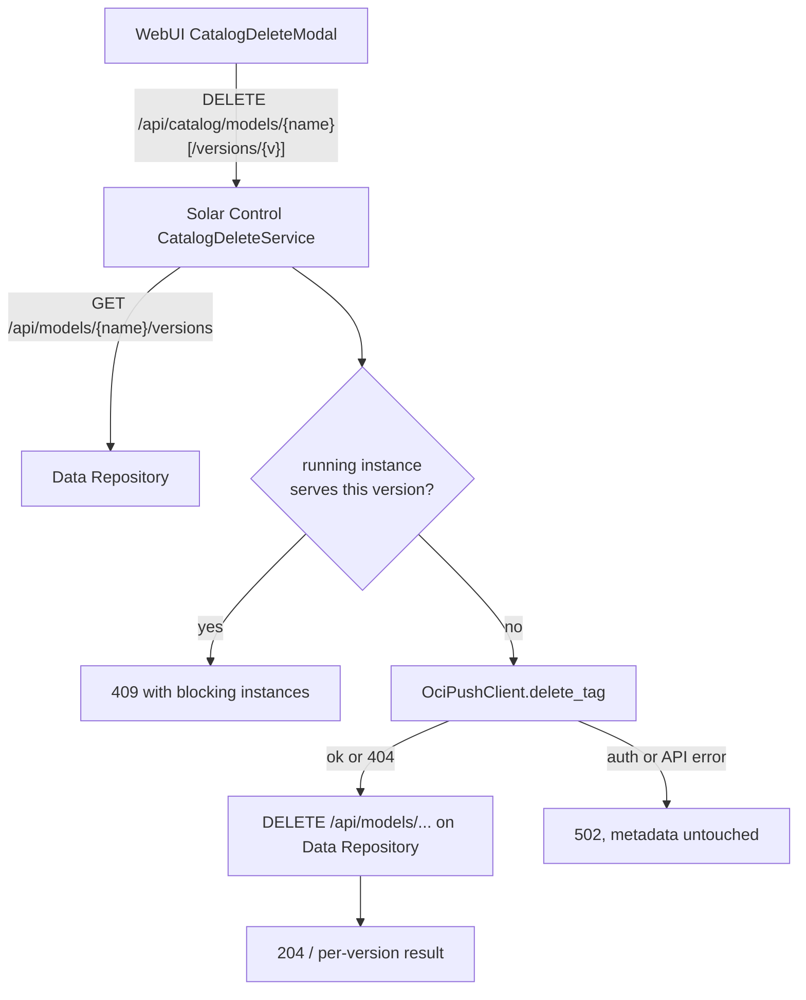

# Artifact Delete Specification

| Field       | Value                                   |
|-------------|-----------------------------------------|
| Issues      | D-019, S-048, U-008                     |
| Status      | Draft                                   |
| Created     | 2026-08-05                              |
| Depends on  | D-013, D-018, S-047                     |
| Depended by | —                                       |

## 1. Overview

The catalog is read-only today: an artifact pushed to Harbor and registered in the
Data Repository cannot be removed from the product. Mistaken or obsolete uploads
accumulate with no supported cleanup path. This specification defines deletion at
two levels — one version, or an entire repository — orchestrated by Solar Control
so the WebUI keeps talking only to Solar Control.

The delete flow mirrors the upload relay direction (S-047): **Solar Control deletes
the Harbor artifact first, then unregisters the metadata in the Data Repository.**
Harbor-first ordering is deliberate:

1. If the unregister fails after Harbor succeeded, a retry still converges because
   the Harbor tag delete tolerates a missing tag (404).
2. The reverse order would orphan a blob with no reference left to find it by.

The Data Repository stays a pure registry: its delete endpoints remove rows only.
Harbor blob deletion is owned by Solar Control, which already holds the Harbor
command path for artifact writes.

### 1.1 Non-goals

- **Dataset delete UI.** The catalog page lists models only; datasets get the API
  support (D-019) but no UI yet.
- **Host cache eviction.** Deleting a version does not remove files from hosts where
  they were pulled. Host-cached copies remain until evicted through the storage
  management flow; the UI warns about this.
- **Lineage integrity.** A deleted version may still be referenced by another
  artifact's `lineage` metadata. Registration validates lineage references at write
  time; deletion does not re-check them. Dangling references are accepted and
  surfaced only by a later resolution attempt.
- **Blob space reclamation.** Harbor garbage collection reclaims blob storage on its
  own schedule; deletion removes the artifact records, not immediately the disk
  blocks.
- **Repository deletion rights.** The robot account may delete artifacts but not
  repositories. A repository-level DELETE is attempted best-effort; real Harbor
  auto-removes an empty repository after its last artifact is deleted, so the
  explicit call is a fallback, not a requirement.

## 2. Delete flow

The version-aware guard matches `repo://{name}:{version}` exactly and treats
`repo://{name}:latest` as matching the artifact's **newest** version, because
deleting the newest version changes what `latest` resolves to. Only running
instances block; host-cached copies do not.

## 3. Data Repository API (D-019)

Pure unregister operations; no Harbor side effects. Version rows disappear via the
existing `ON DELETE CASCADE`.

| Method | Path | Success | Errors |
|--------|------|---------|--------|
| DELETE | `/api/models/{name}` | 204 | 404 unknown name, 422 invalid name |
| DELETE | `/api/datasets/{name}` | 204 | 404 unknown name, 422 invalid name |

Existing version-delete endpoints (`DELETE /api/{models,datasets}/{name}/versions/{version}`)
are unchanged: they remain unregister-only. Harbor cleanup for a version delete is
performed by Solar Control (S-048) before the unregister call.

## 4. Solar Control API (S-048)

| Method | Path | Success | Errors |
|--------|------|---------|--------|
| GET | `/api/catalog/models/{name}/versions` | 200 — Data Repository version list, each item enriched with a `solar` block (`running_instances`, `deployed_hosts`) | 404 unknown model, 502 upstream |
| DELETE | `/api/catalog/models/{name}/versions/{version}` | 204 | 409 blocking instances, 422 `latest`/invalid name, 404 unknown, 502 Harbor failure |
| DELETE | `/api/catalog/models/{name}` | 200 — `{name, deleted: [...], failed: [{version, detail}], artifact_removed, harbor_repository_removed}` | 409 blocking instances, 422 invalid name, 404 unknown, 502 Harbor failure |

### 4.1 Delete semantics

- **Version delete**: validate → fetch the version (404 if unknown) → guard → Harbor
  `delete_tag` (404 tolerated; other failures → 502, metadata untouched) → unregister
  (204 **and** 404 both count as success — the row may already be gone).
- **Repository delete**: fetch all versions in one call → guard across all versions →
  `delete_tag` per version, collecting failures → unregister each tag whose Harbor
  delete succeeded → when all versions are clean, `DELETE /api/models/{name}` and a
  best-effort `delete_repository()`. Any Harbor failure leaves the artifact row in
  place and returns per-version failures so the user can retry.

### 4.2 `harbor_repository_removed` semantics

`true` when the repository DELETE succeeded (200/202) or the repository is already
gone (404); `false` when forbidden (403) or on any other status. Because real Harbor
auto-removes an empty repository after its last artifact is deleted, **404 is the
normal outcome after a successful artifact delete** — the flag reports the
repository's absence, not whether the robot account holds the delete permission.

## 5. WebUI (U-008)

- `ModelDetail` gains a **Versions** section (lazy-fetched): one row per version
  (version, size, created, deployment badge) with a trash action, plus a
  "Delete repository" action next to Deploy.
- `CatalogDeleteModal` (two-phase, modelled on `StorageDeleteModal`):
  - **Blocked state**: 409 instance list rendered, confirm disabled.
  - **Warning**: model still cached on hosts — host copies remain until evicted.
  - **Typed name confirmation** for whole-repository delete.
  - **Results phase**: per-version outcomes on partial failure.
  - `bg-nord-11` destructive button per existing convention.
- After a successful delete the catalog list refetches (`StoragePage.handleDeleteDone`
  pattern). No toast library exists; feedback stays inline.

## 6. Security

- All endpoints sit behind the existing management API key (`auth_middleware`).
- The WebUI never calls the Data Repository or Harbor directly; everything goes
  through the `/api/control` proxy, which injects the management key.
- Harbor calls use the robot account credentials held by Solar Control; the v2.0
  API accepts basic auth directly. The cookie jar is never used (CSRF suppression
  is already enforced by `OciPushClient`).
- 409 responses list blocking instance IDs and host names — operational data, not
  secrets.

## 7. Limits and edge cases

- Deleting a version while another artifact's `lineage` references it leaves a
  dangling reference (non-goal, §1.1).
- Deleting the newest version while an instance runs `repo://{name}:latest` is
  blocked, because `latest` would silently resolve to an older version.
- Concurrent delete/register on the same artifact is not serialized; the system is
  a single-operator tool and both operations are idempotent on retry. A delete
  racing a registration may leave the new version unregistered while its Harbor
  artifact is deleted — the operator re-registers.
- An artifact whose versions were all deleted previously keeps its artifact row
  (ghost entry with `versions_count: 0`); repository delete removes it.
- `version == "latest"` is rejected with 422 at both the Data Repository and the
  Solar Control edge (defensive duplication of the reserved-alias rule).

## 8. Open questions

- Whether the `supernova` robot account should gain repository-delete permission in
  production. Currently the explicit repository DELETE returns 403 and the flag
  reports `false`; empty repositories are still auto-removed by Harbor. Worth a
  follow-up note in `aiops-k8s` if truly empty projects are required.

## 9. Verification record

- [ ] Data Repository unit tests: cascade delete, 404/422 mapping, commit-before-return.
- [ ] Solar Control unit tests: Harbor-first ordering, 404 tolerance on every step,
      409 guard incl. `latest` alias, partial repository delete, flag semantics.
- [ ] WebUI Vitest: version list, delete flows, blocked state, typed confirmation.
- [ ] Integration suite: upload → delete version → resolve 404s; two versions →
      delete repo → catalog and Harbor empty; Harbor rejects delete → metadata
      survives.
- [ ] Manual dev check: `test-` prefixed repository in the `supernova` project
      (S-045 convention), including the `harbor_repository_removed` flag outcome.
