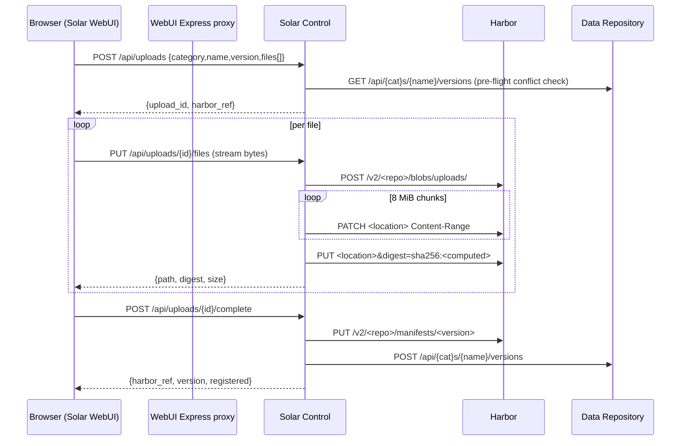

# Artifact Upload Specification

| Field       | Value                                   |
|-------------|-----------------------------------------|
| Issues      | S-045, S-046, S-047, U-007              |
| Status      | Draft                                   |
| Created     | 2026-08-05                              |
| Depends on  | D-007, S-030, S-015, D-018              |
| Depended by | —                                       |

## 1. Overview

Some models we train cannot be published to HuggingFace. Today the only way to get
such a model into the platform is to run a SuperNova training pipeline whose final
`upload_model` step pushes to Harbor and registers the version. There is no path for
an operator who already has a finished model directory on their machine.

This specification defines that path: a folder on the operator's machine is uploaded
through the Solar WebUI, streamed by Solar Control into Harbor as an OCI artifact,
and registered as a version in the Data Repository. It also fixes the artifact layout
produced by the `upload_model` step, which today writes a layout Solar Host cannot
consume.

Two problems are in scope:

1. **The artifact layout contract is broken.** `upload_model` pushes a single
   `model.tar.gz` layer; Solar Host pulls flat and never untars. Models produced by
   the training pipeline are therefore unusable for llama.cpp inference.
2. **There is no interactive upload path.** Nothing in the WebUI, Solar Control, or
   the Data Repository accepts artifact bytes.

Both are addressed by the same underlying decision: **flat file-per-layer is the
canonical SuperNova artifact layout**, and every producer must emit it.

### 1.1 Non-goals

- Resumable uploads (a failed file is re-uploaded from the start).
- Uploading via the Data Repository API. It stays metadata-only; blobs never
  transit it.
- Replacing the `upload_model` step for pipeline-produced models.
- Editing an existing version. Versions remain immutable.

## 2. Canonical artifact layout

### 2.1 Contract

A SuperNova artifact is an OCI image manifest with **one layer per file**.

```json
{
  "schemaVersion": 2,
  "mediaType": "application/vnd.oci.image.manifest.v1+json",
  "config": {
    "mediaType": "application/vnd.supernova.model.config.v1+json",
    "digest": "sha256:<config-digest>",
    "size": 142
  },
  "layers": [
    {
      "mediaType": "application/vnd.oci.image.layer.v1.tar",
      "digest": "sha256:<sha256 of the exact file bytes>",
      "size": 20971520,
      "annotations": {
        "org.opencontainers.image.title": "model-00001-of-00002.safetensors"
      }
    }
  ],
  "annotations": {
    "org.opencontainers.image.created": "2026-08-05T08:20:00Z"
  }
}
```

Rules:

| Rule | Value |
|------|-------|
| Layer digest | sha256 of the **raw, uncompressed** file bytes |
| Layer size | raw file size in bytes |
| Layer media type | `application/vnd.oci.image.layer.v1.tar` (the `oras` default for plain files) |
| File name | `org.opencontainers.image.title`, a POSIX-relative path from the artifact root |
| Config media type | `application/vnd.supernova.{model,dataset}.config.v1+json` |
| Config content | JSON: `{artifact_type, name, version, metadata}` |
| Compression | None. Files are stored verbatim. |

The config blob carries no `org.opencontainers.image.title` annotation, so `oras`
does not write it to disk on pull. It exists to make the artifact self-describing in
Harbor.

### 2.2 Why not tar.gz

`OrasHelper.push_custom` tars the content directory into a single layer. Verified
against the live registry, an artifact pushed that way pulls back as:

```
pulled top-level: ['model.tar.gz']
VERIFY: OK -> ['model.tar.gz']
GGUF SELECT: None
```

Solar Host's `_pull_harbor` never untars, and `_select_gguf_path` then finds no
`.gguf` and raises `404 not_found` ("artifact without any .gguf is a client error").
The same fixture pushed flat behaves correctly:

```
pulled top-level: ['config.json', 'model-Q4_K_M.gguf', 'tokenizer.json']
VERIFY: OK -> ['config.json', 'model-Q4_K_M.gguf', 'tokenizer.json']
GGUF SELECT: /tmp/.../model-Q4_K_M.gguf
```

Flat layout also gives per-file digests, which is what `_verify_pulled_digests`
already assumes ("flat layers: layer digest = sha256 of the exact file bytes"), and
enables `repo://name:version/subpath` addressing. A tarball defeats both.

### 2.3 Path rules

`org.opencontainers.image.title` MUST be:

- relative, using `/` separators;
- free of `.` and `..` segments;
- free of a leading `/` or a drive letter;
- unique within the manifest.

Nested paths are permitted — `oras` recreates intermediate directories on pull
(verified). Producers and consumers MUST reject titles violating these rules; a
title such as `../../etc/passwd` would otherwise let a malicious artifact escape the
target directory on pull.

> **Consumer bug (S-046).** `_verify_pulled_digests` iterates `target_dir.iterdir()`
> non-recursively and keys on `path.name`, so a nested file is reported as
> `missing on disk after pull` and the pull fails with `ModelPullError`. Verified:
> a flat artifact containing `nested/extra.txt` fails verification even though
> `oras` restored it correctly. Verification must walk recursively and key on the
> path relative to `target_dir`.

## 3. Upload paths

Two producers emit the layout above.

| Path | Producer | Trigger | Source of bytes |
|------|----------|---------|-----------------|
| Pipeline | `supernova-steps/upload-model` | Final step of a training job | Job workspace on a Solar Host |
| Interactive | Solar WebUI → Solar Control | Operator action | Folder on the operator's machine |

Both end at the same two calls: `PUT /v2/<repo>/manifests/<tag>` on Harbor, then
`POST /api/{models,datasets}/{name}/versions` on the Data Repository.

### 3.1 Pipeline path (S-045)

`push_to_harbor` switches from `OrasHelper.push_custom` to a flat push. The step
already has the files on local disk, so `OrasHelper.push` (one layer per file,
title annotations) is sufficient and requires no new library code.

Consequences:

- `prepare_content_dir` is no longer needed for the directory case; a single-file
  source becomes a single-layer artifact named after the file.
- `register_version` can now send a truthful `size_bytes` (the sum of file sizes)
  instead of omitting it, because the stored bytes equal the source bytes.
- The OCI config blob keeps the SuperNova media type via a small manifest assembly
  helper rather than `push_custom`.

### 3.2 Interactive path (S-047 + U-007)



Note the WebUI reaches Solar Control through the existing `/api/control` proxy. The
topology constraint from U-002 holds: **the WebUI never calls the Data Repository or
Harbor directly.**

## 4. Solar Control relay

### 4.1 Why a relay rather than a direct browser upload

Harbor does not support CORS. Verified against the live registry:

```
$ curl -X OPTIONS https://imgrepo.damit.hu/v2/supernova/test/blobs/uploads/ \
    -H "Origin: https://solar-webui.damit.cloud"
HTTP/1.1 401 Unauthorized
{"errors":[{"code":"UNAUTHORIZED","message":"un-recognized request: OPTIONS ..."}]}
```

No `Access-Control-Allow-Origin` on any response and preflight is not a recognised
route. Harbor is not deployed from `aiops-k8s`, so enabling CORS is not a change we
control. The bytes must pass through a service we own.

Relaying is cheap: the OCI blob upload protocol is chunked, so Solar Control reads
the request body in fixed-size chunks and forwards them, never holding more than one
chunk in memory. **No staging to disk and no PVC is required**, which is what makes
this viable under the current 256Mi memory limit.

### 4.2 Endpoints

All under `/api/`, so the existing management API key middleware applies.

| Method | Path | Body | Response |
|--------|------|------|----------|
| `POST` | `/api/uploads` | `{category, name, version?, files:[{path,size}], metadata?}` | `{upload_id, harbor_ref, name, version, expires_at}` |
| `PUT` | `/api/uploads/{upload_id}/files?path=<rel>` | raw bytes | `{path, digest, size}` |
| `GET` | `/api/uploads/{upload_id}` | — | `{state, files:[{path,size,digest,uploaded}], bytes_total, bytes_done}` |
| `POST` | `/api/uploads/{upload_id}/complete` | — | `{name, version, category, harbor_ref, size_bytes, registration}` |
| `DELETE` | `/api/uploads/{upload_id}` | — | 204 |

`POST /api/uploads` validates before a single byte moves:

- `category` ∈ {`model`, `dataset`}.
- `name` matches `^[a-z0-9][a-z0-9._-]{0,254}$` (mirrors `_NAME_RE` in the Data
  Repository).
- `version` matches `^[A-Za-z0-9][A-Za-z0-9._-]{0,127}$` and is not `latest`.
- Every `files[].path` satisfies §2.3 and the list is non-empty.
- The artifact either does not exist or has the same category; the version does not
  already exist. Checked against the Data Repository so the operator fails in the
  form rather than after a 40-minute upload.

If `version` is omitted, Solar Control resolves the next `v{n}` the same way the
Data Repository would, and returns it so the UI can display the target.

### 4.3 Session state

Upload sessions live in **Redis**, which Solar Control already depends on for host
connection state and routing. Postgres is unnecessary and pod-local state would
break across the two replicas.

```
key   upload:{upload_id}
type  hash
ttl   24h (refreshed on each file completion)
value {category, name, version, harbor_ref, repo, metadata,
       files: [{path, size, digest?, uploaded_at?}], state}
```

`state` ∈ {`pending`, `uploading`, `completing`, `completed`, `failed`, `aborted`}.

Any replica can serve any request in the session. The Harbor blob upload session is
opened and closed within a single `PUT .../files` request, so no registry-side state
crosses requests.

### 4.4 Streaming to Harbor

Per file:

1. `POST /v2/<repo>/blobs/uploads/` → `202`, `Location` header.
2. For each 8 MiB chunk read from the client request body:
   `PATCH <location>` with `Content-Range: <start>-<end>` and
   `Content-Type: application/octet-stream` → `202`, new `Location`.
   The sha256 is updated as each chunk passes through.
3. `PUT <location>&digest=sha256:<computed>` with an empty body → `201`.

Four registry behaviours were established empirically and are **binding on the
implementation**:

| # | Behaviour | Consequence |
|---|-----------|-------------|
| 1 | Harbor sets a `sid` cookie on `/v2/` responses. Sending it back on a write request fails with `403 FORBIDDEN — CSRF token invalid`. | The HTTP client MUST NOT persist cookies across the upload sequence. |
| 2 | The upload `Location` carries a `_state` query parameter that must be returned verbatim. Replacing the query string (e.g. `httpx` `params=`) fails with `404 BLOB_UPLOAD_INVALID`. | Append `&digest=` to the existing query; never rebuild it. |
| 3 | Chunked `PATCH` at 8 MiB succeeds (a 20 MiB file uploaded in 3 chunks). | 8 MiB is above the 5 MiB minimum that object-storage registry drivers impose, so the chunk size is safe regardless of Harbor's backend. |
| 4 | A freshly minted bearer token is accepted mid-session, including for the closing `PUT`. | The relay refreshes the token when it nears the 30-minute TTL, so upload duration is unbounded. |

The digest is computed by Solar Control while streaming, so the client performs no
hashing and does not need to know the digest in advance.

### 4.5 Completion, registration, and failure

`complete` requires every declared file to have been uploaded. It then:

1. Uploads the config blob and `PUT`s the manifest.
2. Calls `POST {DATA_REPOSITORY_URL}/api/{category}s/{name}/versions` with
   `harbor_ref`, `checksum` = manifest digest, `size_bytes` = **sum of file sizes**,
   and `metadata`.
3. On registration failure, deletes the just-pushed Harbor tag (the robot account
   may delete artifacts) and returns the Data Repository's error, so a retry is not
   blocked by a half-created version.

> `size_bytes` must be sent explicitly. If omitted, the Data Repository falls back
> to the `Content-Length` of the HEAD manifest response, which is the size of the
> manifest JSON — 1241 bytes for a 20 MiB artifact in the spike — not the artifact
> size. The pipeline step omits it today for a related reason (§3.1).

Orphaned blobs from an abandoned session are harmless: unreferenced blobs are
reclaimed by Harbor garbage collection.

### 4.6 Authentication

| Hop | Mechanism |
|-----|-----------|
| Browser → WebUI Express | Existing `solar_webui_auth` cookie gate (when `SOLAR_WEBUI_AUTH_KEY` is set) |
| WebUI Express → Solar Control | Existing injected management API key |
| Solar Control → Harbor | **New**: robot account credentials, OCI token flow |
| Solar Control → Data Repository | Existing `DATA_REPOSITORY_API_KEY` |

Solar Control gains `HARBOR_URL`, `HARBOR_USERNAME`, `HARBOR_PASSWORD`. It holds no
Harbor credentials today; the `repo://` resolver only resolves metadata and lets
Solar Host pull with its own credentials.

## 5. Solar WebUI

### 5.1 Category selection

The first step is an explicit **Model** / **Dataset** choice. It is not inferred
from the folder contents, because it determines the Data Repository endpoint, the
OCI config media type, and the metadata form.

Each category renders its own requirements panel and its own validation.

**Model**

| Item | Rule |
|------|------|
| Expected contents | HuggingFace-format directory (`config.json` + weights) **or** one or more `.gguf` files |
| Warning | No `config.json` and no `*.gguf` → "Solar Host will not be able to serve this artifact" (warning, not a hard block) |
| Metadata fields | description, base model (`lineage.parent_model`), source dataset (`lineage.source_dataset`), training config (JSON), eval metrics (JSON) |

**Dataset**

| Item | Rule |
|------|------|
| Expected contents | Data files matching the declared format |
| `format` | **Required**, one of `parquet`, `hdf5`, `json` — the Data Repository rejects anything else on registration |
| Warning | No file extension matches the declared format |
| Metadata fields | description, format, record count, source |

### 5.2 Folder selection

A browser cannot read a typed filesystem path — it can only receive files the user
explicitly grants. The picker is therefore:

```html
<input type="file" webkitdirectory directory multiple />
```

This yields a flat `FileList` where each `File` carries `webkitRelativePath` such as
`my-model/weights/model-00001.safetensors`. Directories themselves are never
included, which satisfies "only files end up in the repo" by construction. The
first path segment is the chosen folder's own name and is stripped, so the artifact
root is the folder's contents.

`showDirectoryPicker()` (File System Access API) may be added later as a
progressive enhancement for a nicer picker, but it is Chromium-only and is not
required.

The following are excluded automatically, with the exclusion list shown to the user:

```
.git/**  .gitattributes  .gitignore  .DS_Store  Thumbs.db  desktop.ini
__pycache__/**  *.pyc  *.tmp  *.part  *.lock  .ipynb_checkpoints/**
```

The review table lists every remaining file with its relative path and size, each
individually deselectable, plus a running total and file count. Empty selection and
any path violating §2.3 block submission.

### 5.3 Progress and errors

- Uploads run with a small concurrency limit (2–3 files in flight) to keep a large
  shard from stalling the whole queue.
- `XMLHttpRequest` is used rather than `fetch`, because `upload.onprogress` is the
  only reliable source of upload progress events.
- Per-file state (queued / uploading / done / failed) plus an aggregate byte
  progress bar and an estimated remaining time.
- A failed file can be retried individually; the session survives because state
  lives in Redis.
- Navigating away is guarded by `beforeunload` while an upload is in flight.
- On success, the UI links to the new version in the catalog.

## 6. Deployment (`aiops-k8s`)

Changes to `charts/solar` and the `solar` / `solar-dev` environment values.

### 6.1 Ingress

The Solar Control ingress currently caps request bodies at 10 MB:

```yaml
    annotations:
      nginx.ingress.kubernetes.io/proxy-read-timeout: "3600"
      nginx.ingress.kubernetes.io/proxy-send-timeout: "3600"
      nginx.ingress.kubernetes.io/proxy-body-size: "10m"
```

It becomes:

```yaml
    annotations:
      nginx.ingress.kubernetes.io/proxy-read-timeout: "3600"
      nginx.ingress.kubernetes.io/proxy-send-timeout: "3600"
      nginx.ingress.kubernetes.io/proxy-body-size: "0"
      nginx.ingress.kubernetes.io/proxy-request-buffering: "off"
```

`proxy-request-buffering: "off"` is not optional. Without it the ingress controller
buffers the entire request body to its own local disk before forwarding anything,
which reintroduces the staging problem on a pod we do not control and would fill the
node's ephemeral storage on a large upload.

The **solar-webui** ingress needs the same two annotations, because the upload
request reaches Solar Control through the WebUI's Express proxy and therefore
crosses that ingress first. It currently sets no annotations at all and so inherits
the 1 MB nginx default.

### 6.2 Secret

`HARBOR_USERNAME` and `HARBOR_PASSWORD` are added to `solar-control-secret` in both
environments' sealed secrets, and `HARBOR_URL` to the Solar Control ConfigMap
(mirroring `data-repository`, which already has all three).

`secrets.yaml.example` is updated for both environments.

### 6.3 Resources

Relaying is memory-flat, so the 256Mi limit is adequate. The 250m CPU limit is the
throughput ceiling — sha256 plus TLS re-encryption on both hops. Raise Solar Control
to `1000m` so a single upload does not throttle inference routing on the same pod:

```yaml
resources:
  requests: {cpu: "50m", memory: "128Mi"}
  limits:   {cpu: "1000m", memory: "512Mi"}
```

The WebUI Express proxy streams with `http-proxy-middleware` (constant memory), but
its 100m CPU limit becomes the bottleneck for TLS on the browser-facing hop; raise
it to `500m`.

### 6.4 WebUI proxy timeout

`PROXY_TIMEOUT_MS` already defaults to 900000 (15 minutes). A single large shard can
exceed that, so it is raised to `3600000` to match the ingress timeouts.

## 7. Security

| Concern | Mitigation |
|---------|------------|
| Path traversal via layer titles | §2.3 validation in the relay at session creation, and in Solar Host on pull |
| Harbor credentials reaching the browser | They never leave Solar Control; the browser talks only to `/api/control` |
| Unauthenticated upload | `/api/` management key middleware, plus the WebUI auth cookie gate |
| Resource exhaustion by a large upload | Chunked relay bounds memory; ingress timeouts bound duration; CPU limit bounds throughput |
| Overwriting an existing version | Pre-flight conflict check plus the Data Repository's own 409 on registration |
| Abandoned sessions | Redis TTL; unreferenced Harbor blobs reclaimed by garbage collection |

## 8. Limits

| Limit | Value | Rationale |
|-------|-------|-----------|
| Chunk size (relay → Harbor) | 8 MiB | Above the 5 MiB object-storage driver minimum |
| Max single file | Unbounded | Token refresh removes the 30-minute ceiling |
| Max request duration | 3600 s | Ingress `proxy-read-timeout` / `proxy-send-timeout` |
| Session TTL | 24 h | Redis key expiry |
| Concurrent files per session | 2–3 | Client-side, keeps progress legible |

## 9. Open questions

1. **Does the operator need a dataset `format` per file?** The Data Repository
   validates a single `metadata.format` per version. Mixed-format datasets are not
   expressible today.
2. **Should `upload_model` reuse the relay?** It has direct Harbor access from the
   host and no reason to route through Solar Control. Kept separate for now, at the
   cost of two implementations of manifest assembly. If a third producer appears,
   the assembly belongs in `harbor-oci-client`.
3. **Retention.** Interactive uploads make it easier to create orphaned versions.
   N-029 (retention policy) becomes more relevant once this ships.

## 10. Verification record

Every registry behaviour asserted above was checked against `imgrepo.damit.hu`
under `supernova/test-upload-spike-*` on 2026-08-05, using the robot account. The
test artifacts were deleted afterwards; the empty repositories remain because the
robot account is not permitted to delete repositories.

| Claim | Result |
|-------|--------|
| Chunked `PATCH` blob upload, 8 MiB chunks | 20 MiB file uploaded in 3 chunks, `202` each |
| Flat file-per-layer manifest accepted | `201`, manifest digest returned |
| Data Repository HEAD verification | `200`, digest and `Content-Length: 1241` |
| `oras` pull round-trip | 4/4 files byte-identical, nested path recreated |
| Solar Host `_verify_pulled_digests`, flat | OK |
| Solar Host `_verify_pulled_digests`, nested | **FAILED** — `nested/extra.txt: missing on disk after pull` |
| Solar Host `_select_gguf_path`, flat | Selected `model-Q4_K_M.gguf` |
| Solar Host `_select_gguf_path`, tar.gz | **None** — artifact unusable |
| Cookie replay | `403 CSRF token invalid` |
| Query string replaced on close | `404 BLOB_UPLOAD_INVALID` |
| Token rotation mid-session | `202` per chunk, `201` on close |
| Harbor CORS preflight | `401`, no `Access-Control-*` headers |
