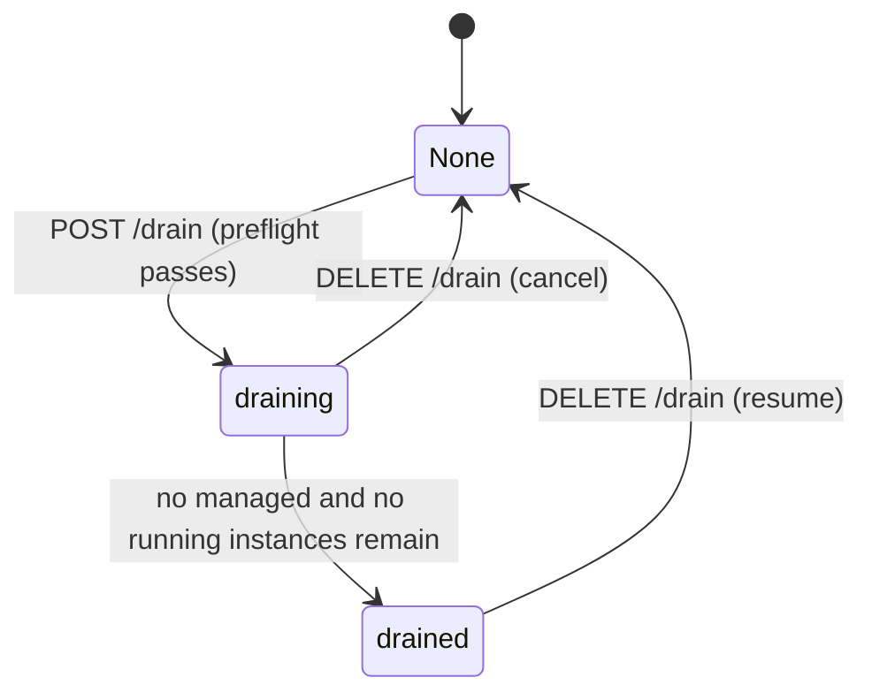

# Host Draining Specification

| Field       | Value                          |
|-------------|--------------------------------|
| Issue       | S-043                          |
| Status      | Draft                          |
| Created     | 2026-08-04                     |
| Depends on  | S-037, S-038, S-041            |
| Depended by | U-005                          |

## 1. Overview

Hosts need to leave service temporarily: an OS or driver upgrade, a hardware swap, a physical move. Solar Control has no supported way to express that today. `DELETE /api/hosts/{id}` removes the database row and abandons whatever is running on the machine, and stopping instances by hand does not work for intent-managed replicas — the S-041 reconciler observes the shortfall and recreates them on the same host within a tick.

This specification defines **draining**: a durable, operator-initiated host state meaning *no new work here, and move the existing managed work away*. It reuses the S-037 migration primitive and the S-041 reconciliation loop rather than introducing a separate orchestrator, so draining behaves like every other convergence in the system — level-triggered, restart-safe, and one action per tick.

Two properties are deliberate and shape the whole design:

- **A drain never reduces serving capacity on its own.** If a replica has nowhere to go, it keeps serving and the drain stays unfinished until capacity appears or the operator intervenes.
- **A drain never touches manually created instances.** They have no declared desired state, so moving or stopping them would be Solar Control making a decision about a workload nobody asked it to manage. Their presence blocks the drain from starting instead.

## 2. Drain state

### 2.1 States

Drain state lives on the host record, alongside but independent of `status`.

| State | Meaning |
|-------|---------|
| *(absent)* | Normal operation. The host is eligible for placement. |
| `draining` | Evacuation in progress. No new work is placed here; managed replicas are being migrated away. |
| `drained` | Evacuation complete. Nothing is executing on the host and nothing will be placed here. Safe to take offline. |

Transitions:



`draining → drained` is computed by Solar Control, not requested. A host is `drained` when it has **no intent-managed instances** and **no running instances** of any kind. Stopped manual instances may remain: the preflight requires them to be stopped, not deleted, and a stopped process consumes no GPU.

The state is persisted (`hosts.drain_state`, with `hosts.drain_requested_at`) so a drain survives a Solar Control restart and is visible to every replica. It is never inferred from instance counts.

### 2.2 Relation to neighbouring concepts

Draining is easy to confuse with three existing mechanisms. It overlaps with none of them:

| Mechanism | What it does | Why it is not draining |
|-----------|--------------|------------------------|
| `status` (`online`/`offline`/`error`) | Reports reachability, set by connection and health probes | A draining host is still online and still serving. Drain is an operator's intent, not an observation. |
| `roles` | Declares what a host is capable of | Removing `inference` would stop new placement, but it is a capability statement, and it evacuates nothing. |
| `placement.host_deny` (deployment-intent.md §4.5) | Excludes a host from placement **for one intent** | Cluster-wide vs per-intent, and deny never moves what is already running. |

## 3. Preflight

`POST /api/hosts/{id}/drain` validates before changing state, and rejects with `409` and a structured list of blockers so a client can tell the operator exactly what to fix.

| Blocker | `kind` | Rule |
|---------|--------|------|
| Running manual instance | `manual_instance` | Any instance on the host that is not intent-managed and is not stopped. The operator stops (or deletes) it first. |
| Active job step | `active_job` | Any non-terminal job step on the host. |

An instance is **intent-managed** when its config carries `managed_by == "intent"` and an `intent_id`; this is the same test the reconciler uses to decide ownership (deployment-intent.md §5.4), and the two must never disagree.

Active job steps block for a concrete reason rather than a philosophical one: `execute_migration` refuses a source host with active training jobs (S-037), so every evacuation would fail for as long as the job runs. Blocking up front turns a silent stall into an actionable message. The check queries the same source `execute_migration` does, so the preflight cannot pass where migration would refuse.

Starting a drain is idempotent: requesting it for a host already `draining` or `drained` returns the current status rather than an error.

While a host is `draining` or `drained`, `POST /api/hosts/{id}/instances` is rejected with `409`. Manual instance creation targets a host explicitly and therefore bypasses placement, which would otherwise let an operator refill a host that another operator is emptying.

## 4. Evacuation

### 4.1 Placement

`placement.find_candidates()` (deployment-intent.md §8.4) skips hosts with any drain state. The filter belongs in the shared helper so it applies to intent reconciliation and the S-038 reservation coordinator alike — one policy, and no possibility of a drain pushing a replica onto another host that is itself being emptied.

### 4.2 Reconciler actions

The reconciler already enumerates the managed instances of each intent and the hosts they sit on. Two rules apply when that host is `draining`:

| Observed | Action | Rationale |
|----------|--------|-----------|
| Managed replica **running** on a draining host | `evacuate` — migrate to the best remaining placement candidate via S-037, then delete the source | Preserves the replica; the alias keeps serving from the target. |
| Managed replica **not running** (`failed`/`stopped`/`error`) on a draining host | `stop` (stop and delete) instead of the usual `recreate` | `recreate` restarts it on the same host, which fights the drain. Deleting it drops `observed_replicas`, and the next tick's `create` places a fresh replica elsewhere, because placement now excludes this host. |

A replica that is already being replaced for drift (`replace`, or an in-flight strategy step) is left to that path: the rollout stops the old replica and places its replacement through placement, which excludes the draining host, so the drain progresses without a second mechanism acting on the same instance. It also means **an in-flight rollout finishes before evacuation starts** for that intent, which is intentional — two concurrent replacement mechanisms on one alias is how you get a capacity dip.

`evacuate` targets the intent's existing placement candidates, so the target satisfies the intent's own roles, GPU type, allow/deny lists, resource hints, and the one-replica-per-host rule. Evacuation passes `allow_production = true` to the migration: the S-037 production safeguard exists to stop *automated* flows from moving production replicas casually, and an operator's drain request is exactly the explicit policy decision the safeguard asks for.

Evacuation **deletes the source instance** once the migration completes, which is where it departs from S-037. A migration leaves the source stopped and disowned so an operator can inspect or restart it after a one-off move (D-017); a drain cannot afford that, because the leftover still carries the alias in the host's instance list. Placement would then exclude this host for that intent (§8.4 `exclude_alias`), so the replica could never come back, a later drain of its new host would stall with "no existing replica", and the intent would report a permanent manual-instance conflict. The host a drain empties has to be genuinely empty.

Evacuation is a normal reconciler action: one per tick, subject to the per-intent Redis lock, and re-derived from observed state on every pass. Nothing about a drain is held in memory.

### 4.3 Stalling

If no candidate host can accept a replica, the replica **stays running**. Solar Control records why, and the drain status reports the host as stalled. A stalled drain is not an error and does not retry with backoff — it re-evaluates every tick and proceeds by itself as soon as a target becomes eligible (another host comes online, capacity frees up, a constraint changes).

A stall must be distinguishable from progress in any consumer: a host stuck at "1 replica remaining, no eligible target" needs an operator, while a host at "1 replica remaining" mid-migration does not. The reason accompanies the replica, and names the constraints a target would have to satisfy.

Draining is not a licence to displace: evacuation never displaces a lower-priority instance on a candidate host to make room. Displacement is capacity-pressure policy (deployment-intent.md §8.5), driven by the intent that needs capacity, and a drain is not a new intent.

### 4.4 Completion and resume

When a `draining` host has no managed and no running instances left, Solar Control promotes it to `drained` and broadcasts the change. The promotion runs on the reconciler's tick, guarded so concurrent Solar Control replicas do not duplicate the broadcast.

`DELETE /api/hosts/{id}/drain` clears the state from either `draining` or `drained` and makes the host eligible for placement again. Replicas that were moved away are **not** moved back: the reconciler sees an intent whose replica count is satisfied, and rebalancing an already-healthy deployment is not something a resume should trigger. The resumed host receives work the next time an intent needs a replica placed.

## 5. API

All three endpoints live under the existing host management router and require the management API key.

### 5.1 `POST /api/hosts/{host_id}/drain` — start draining

- **202 Accepted** → the drain status (Section 5.4). The host is now `draining`; evacuation happens asynchronously through reconciliation.
- **404 Not Found** → unknown host.
- **409 Conflict** → preflight failed. The body carries the blockers:

```json
{
  "detail": {
    "detail": "Host 'damcpaiops01' cannot be drained yet",
    "blockers": [
      {
        "kind": "manual_instance",
        "id": "inst-7f3a",
        "name": "scratch-qwen",
        "detail": "Manually created instance is running. Stop it before draining."
      }
    ]
  }
}
```

### 5.2 `DELETE /api/hosts/{host_id}/drain` — cancel or resume

- **200 OK** → the drain status with no drain state. Valid from `draining` (cancel a drain in progress) and from `drained` (return a serviced host to the cluster). A no-op on a host that is not draining.
- **404 Not Found** → unknown host.

### 5.3 `GET /api/hosts/{host_id}/drain` — progress

- **200 OK** → the drain status, computed live from observed instance state. Safe to poll.
- **404 Not Found** → unknown host.

### 5.4 Drain status

```json
{
  "host_id": "5c1f...",
  "host_name": "damcpaiops01",
  "drain_state": "draining",
  "drain_requested_at": "2026-08-04T13:22:48.104Z",
  "stalled": true,
  "managed_remaining": 1,
  "manual_running": 0,
  "replicas": [
    {
      "instance_id": "inst-2b91",
      "alias": "iris-osl:110m",
      "intent_id": "9d0c...",
      "status": "running",
      "blocked_reason": "No eligible host: needs roles ['inference'], vram >= 6.0 GB, and no existing replica of 'iris-osl:110m'"
    }
  ],
  "blockers": []
}
```

| Field | Description |
|-------|-------------|
| `drain_state` | `draining`, `drained`, or `null`. |
| `stalled` | True when the host is `draining` and every remaining managed replica is blocked. |
| `managed_remaining` | Intent-managed instances still on the host. |
| `manual_running` | Running manual instances — non-zero means a drain cannot be started. |
| `replicas` | The managed instances still on the host, each with `blocked_reason` set when it cannot currently be moved. |
| `blockers` | Preflight blockers, in the same shape as the `409` body. Populated whether or not a drain is running, so a client can render them before asking. |

## 6. Realtime events

Drain state is added to the existing `host_status` Socket.IO payload rather than introducing a new event, since WebUI clients already replace their whole host entry when one arrives. Solar Control emits `host_status` when a drain starts, is cancelled, or is promoted to `drained`.

Drain state is also added to the per-host entries of `GET /api/resources` (S-035), because operator views read capacity from there rather than from `GET /api/hosts`. The same view carries the instance ownership markers, so a client can distinguish managed from manual instances without a second call.

## 7. Operator runbook

1. Stop any manually created instances on the host, and wait for job steps to finish. `GET /api/hosts/{id}/drain` lists whatever still blocks.
2. `POST /api/hosts/{id}/drain`. The host stops receiving new work immediately.
3. Watch the status until `drain_state` is `drained`. If it reports `stalled`, the cluster has nowhere to put a replica: free or add capacity, or accept the shortfall by scaling the intent down.
4. Do the maintenance. Solar Control will report the host `offline` while it is down; the drain state is unaffected.
5. `DELETE /api/hosts/{id}/drain` to put it back into service.

## 8. Multi-replica behaviour

No new coordination is introduced. Drain state is a Postgres column, so every Solar Control replica reads the same value; evacuation runs inside the existing per-intent Redis lock, so two replicas cannot act on the same intent concurrently; and the `draining → drained` promotion is idempotent and guarded so only one replica broadcasts it. A replica that dies mid-drain loses nothing: the next tick on any replica recomputes the same state from the database and the observed instances.

## 9. Out of scope

- **Force drain.** Stopping replicas that cannot be moved, trading serving capacity for a finished drain, is not offered. The stall is reported and the operator decides — scale the intent down explicitly, or add capacity.
- **Automatic drain.** Nothing sets a drain state on its own. It is always an operator action.
- **Moving replicas back on resume.** Rebalancing a healthy deployment is a separate concern from draining.
- **Draining job workloads.** Active job steps block a drain rather than being migrated; training migration is not a supported operation.
- **Node-level cordon without evacuation.** A separate "no new work but leave everything running" state is not defined; `drained` is only reachable through evacuation.

## 10. Related specifications

- [Declarative Deployment Intent](deployment-intent.md) — §5.4 ownership, §8.2 reconciler actions, §8.4 placement policy, §8.5 displacement.
- [Model Source URI](model-source-uri.md) — the pull that makes a model available on an evacuation target.
- S-037 (instance migration), S-038 (reservation coordinator / shared placement), S-041 (reconciliation engine), U-005 (WebUI controls).
